+++
title = "Marketing Basics"
linkTitle = "Marketing"
math = true
date = "2023-11-21T05:58:51+05:30"
+++



Before starting a business, one must have a **Go To Market Strategy**. This strategy can be created through the following process:
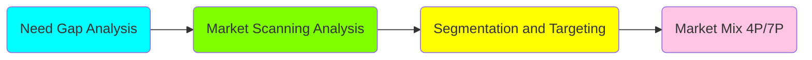

To form a better picture in mind, I'll create a mindmap:
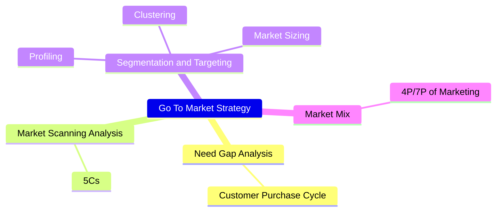

In this whole page, we'll learn this 4 step process to create a **Go To Market Strategy**.

## **Need Gap Analysis**
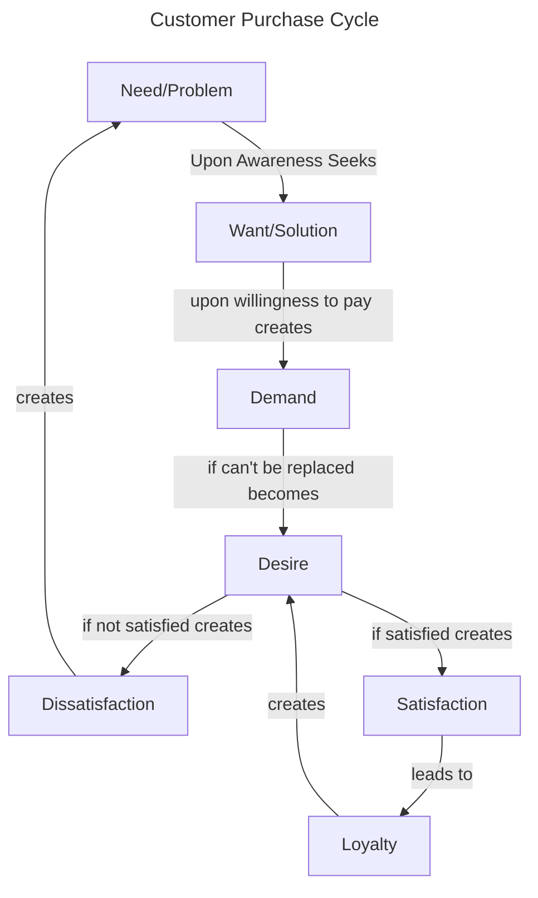

This whole process of customer up till desire, is governed by the **Value**. Marketer seeks to increase value either by increasing the benefits or decreasing the costs for the customer.

### Here are some definitions:


Need is a problem or dissatisfaction.



Want is a solution to a need/problem.



Demand is a want along with willingness to pay.

Demand = Want + Willingness to pay



Desire is a want that cannot be replaced.

Desire = Want + Can't be replaced



Satisfaction is when expectations meet perceived delivery.

Satisfaction = Expectations - Perceived Delivery

When expectations are greater than perceived delivery, it is called Dissatisfaction.



When customer want to buy a specific product only, not substitutes.



Customer buys the known brand. This is generally due to inertia of change, when customer is comfortable buying the known brand and doesn't looks at the substitutes.



When customer wants to buy a specific product because of the sense of belonging. The customer chooses a specific product at any cost, this generally happens when customer feels the brand has similar basic values as themselves.



Value is the sum of benefits for the customer minus all the costs he/she has to pay.

Value = ∑Benefits - ∑Costs


### Roles of Marketer
By analyzing this framework, we can easily understand the roles of Marketer.

1. Create Awareness of a Problem/Need.
2. Create solution.
3. Create demand.
4. Convert demand to desire.
5. Match expectations.

I'll be updating this blog as I learn new things.

### Need Gap Analysis
This simple framework can also be used to find out any gaps in markets, if any. The five types of possible gaps are:
1. Lack of *Awareness* of a problem/need
2. Lack of a *Solution* to a known problem/need
3. No good *Value Proposition* for a good solution
4. Possibility of *Value Enhancement*
5. Customer *Expectations* are not being matched 

{}
A business can be started if there is any one or more of these gaps. A business can't sustain if it doesn't fills all the gap.
{}

## **Market Scanning Analysis**
This is also called Stakeholder Analysis or 5C Analysis. This is basic analysis that any business should do before starting.

Before starting a business, one must check if the business is:
1. Profitable (Competition)
2. Understandable (Customer/Consumer)
3. Feasible (Context)
4. Capable (Company)

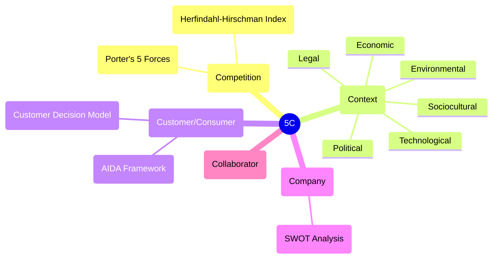

### Competition/Profitability Analysis
One Model of analyzing competition/profitability is called *Porter's 5 Forces*. The five forces are:
1. Bargain Power of Supplier
2. Bargain Power of Buyers
3. Threat of Substitution
4. Threat of New Entrance
5. Extent of Rivalry

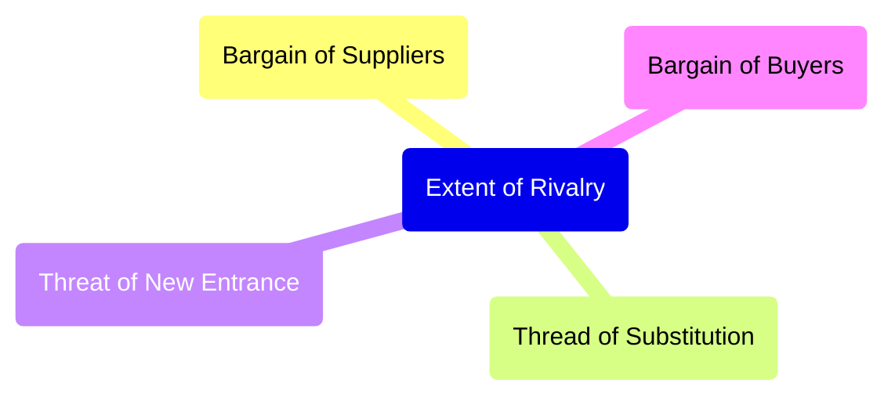

#### Bargain Power of Buyers
If there are multiple brands with similar value propositions, and very few buyers, ie. supply is greater than demand, the buyers have better power to bargain and ask for better prices. They ask brands to lower prices or they may buy from other brands.

Extreme case is when there is only one buyer and multiple sellers, this market is called Monopsony. One example is market of satellites and missiles. The Government is the only buyer, but there are multiple suppliers.

#### Bargain Power of Sellers
If the raw material a brand uses has very few sellers, sellers can have greater bargain power to increase their costs. They may ask higher prices for the raw materials or they may sell it to other company.

Extreme case is when there is only one seller and multiple buyer, this market is called Monopoly. One example is radio frequency bands which can only be bought through governments.

#### Threat of Substitution
If a new product is launched in the market with better value proposition, the brand may have to reduce their prices to increase their value of product and match it with the new product. (Value = ΣBenefits - ΣCosts)

#### Threat of New Entrance
If new product enters the market, it will start replacing the existing products. To increase the customers, the other brands will try to increase their products value by decreasing prices (assuming it cannot add other benefits). This will make the market less profitable.

#### Extent o Rivalry
Rivalry of market depends of two factors, the number of products and the distribution of market shares. If there are more number of products, it means the market is more competitive. If the market share is evenly distributes amongst all products, means the market is more competitive.

##### Herfindahl-Hirschman Index (HII)
HHI is used to measure the extent of rivalry in a market.

In simple words, HHI is the sum of square of market share of all the products in the market.

 The formula of HHI:
$$
 HHI = \sum_{i}(MS_{i})^{2}
$$
$MS$ is Market share of a product.

$ 0 \leq HHI \leq  1 \\ $ if Market Share is in fraction.

$ 0 \leq HHI \leq  10000 \\ $ if Market Share is in percentage.



{}
As a general rule of thumb in industry, **HHI > 0.3** is called a less competitive market and hence more profitable, whereas a market with **HHI < 0.3** is said to be more competitive and less profitable.
{}

### Customer/Consumer
After understanding how to analyze Competition and Profitability, we'll learn how to understand customer/consumer.

{}
**Customers** are the people who buy the product whereas **Consumers** are the people who finally use the product. Example: for baby diapers, baby's parents is the customer (make purchase decision) and the baby is the consumer (actually uses it). Many times customer and consumers are same.
{}

#### AIDA Framework
AIDA Framework is used to understand how consumers make decisions. It stands for:
A -> Awareness about the need/problem
I -> Interest to look for options/alternatives
D -> Desire to choose/consider
A -> Action to buy/not buy

##### Awareness
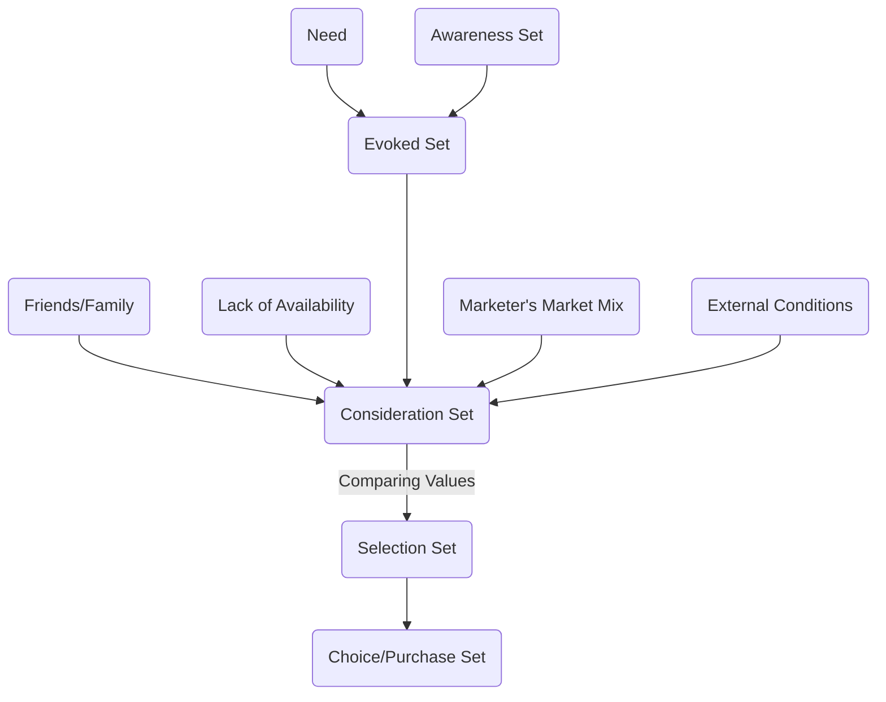

Here are some definitions related to consumer awareness:


Products/brands a consumer is aware about. Any product/brand a consumer has ever heard about will be considered in the Awareness set.



Top-of-the mind brands/products. The brands/products with quick recall for a customer are called Evoked Set for him/her.



Products that a customer considers to buy are called consideration set. The consideration set is often influenced by Friends and Families.



After analyzing Consideration set, the customer narrows it down to Selection Set, which is a handful of products he can buy depending upon the prices and his/her specific needs.



Final products that the customer chooses is called Choice Set/Purchase Set.


In Low Involvement Process, the customer moves from Awareness Set to Selection Set and to Purchase Set. In other words, customer picks up any know product that solves his/her problem without doing much analysis. In High Involvement Situations, the customer passes through all the steps. 

#### Consumer Decision Model (CDM)
Later AIDA model was replaced by *Consumer Decision Model*. CDM takes into account one more step other than AIDA model. Consumer Decision Model considers these five aspects of customer decision:
1. Need/Problem recognition (Awareness)
2. Search for alternatives/options (Intent)
3. Evaluation of alternatives (Desire)
4. Purchase/Consumption (Action) 
5. Post purchase evaluation

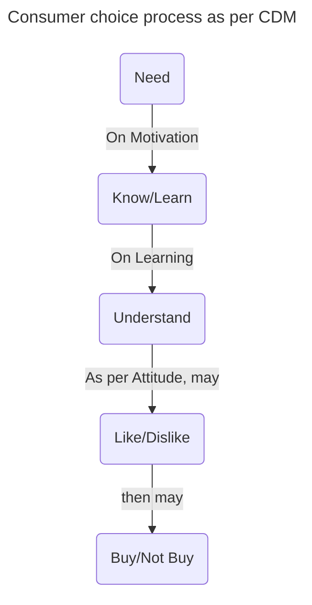

{}
The whole consumer choice process is governed by two factors: **Culture** and **Personality**.
{}

#### Attitude
Attitudes are formed opinions. Attitude has a direction (negative or positive) and magnitude (intensity). In simple words it is what we like or not like.

Attitude starts with Consumption (a person would like to consume a product or not), then it may carry forward towards Product/Product Category (a person likes the product or not), then it carries forward to brand (the customer likes the brand or not).

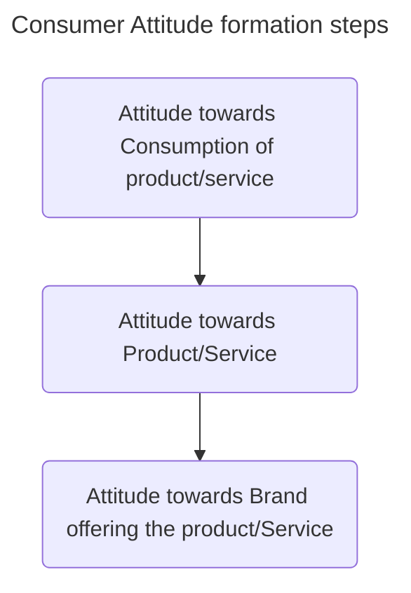

{}
Increasing attitude toward consumption is called **Market Creation Process**. Eg: Ola, Uber created attitude towards convenient taxi.
{}

##### Why we form Attitude?
There are three reasons we form attitude:
1. Value Expression
2. Ego Defensive
3. Utilitarian

{}
You can never be a good marketer with a bad product.
{}

If you know the product is best, make sure the customer goes through all the decision making process.

### Context/Feasibility
Context looks at the Macro Environmental Factors which affects the business. They include:
1. Political
2. Economic
3. Sociocultural 
4. Technological
5. Legal
6. Environmental (Sustainability)

An example of a business satisfying both other Cs but cannot succeed because of the context is BigMac. BigMac is a beef burger very successful in western countries. But it is not a success in India because of the sociocultural factors. In India, most population treats cows as holy animal and would not eat beef burger. the business is *Profitable* (no competition) and *Understandable* (customers have loved the taste worldwide).

An example of Technological context is the advent of AI.

### Company/Capability
Before going into market, the company must know its strengths and the opportunities those strengths will give it, and also the weaknesses and the possible threats those weaknesses can pose to the business. This analysis is called SWOT Analysis (Strengths, Weakness, Opportunities and Threats). SWOT Analysis is by mapping companies strengths to the opportunities those strengths can open up, and mapping weaknesses to the threats those weaknesses can pose to the business.



## **Segmentation, Targeting, Positioning**


Segmentation is the process of dividing customers from heterogenous groups (with different needs) to homogenous groups (similar needs).


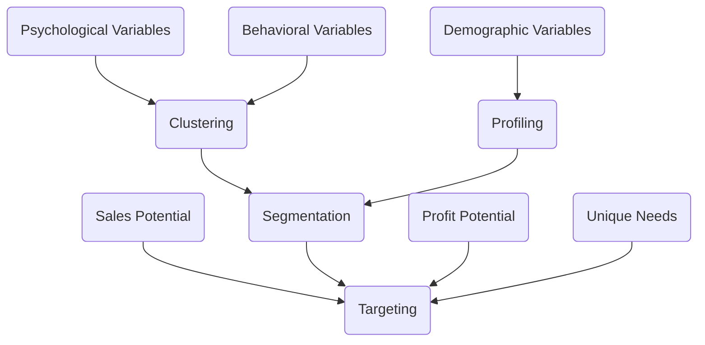


Describing and naming clustered groups.


An inefficient way to segment customers is through demographic variables (age, geography, location, income, religion). This is commonly used because this data is easier to get and more objective. But the accuracy of the formed segments through this process is often low because people with similar demographics may not have similar needs/problems.

The better way to segment customers is through behavioral and psychological variables. People with similar behavioral patterns and interests are more likely facing similar problems.


Personality + Values + Lifestyle/Behaviors


#### Personality
Personalities can be of 3 types:
1. Compliant: Their character traits are:
   - Desire to belong
   - Following rules
   - Need for love and belonging
2. Aggressive: Their character traits are:
   - Need for achievement
   - Success and esteem
   - Need for power
3. Detached: Their character traits are:
   - Break the rules
   - Need for self-actualization
   - Do things because they like to do it
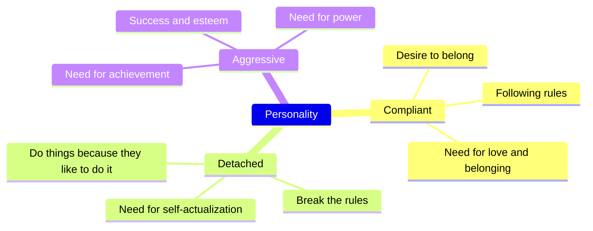

Here is an example of commercial targeting [Aggressive Personality Type](https://www.youtube.com/watch?v=8PHzPmyUeS8).

Here is an example of commercial targeting [Complaint Personality type](https://www.youtube.com/watch?v=_y0y_XeS0fM).

Here is an example of commercial targeting [Detached Personality type](https://www.youtube.com/watch?v=btFwYkWkkhs).

#### Values
Values are formed through upbringing. Values are the beliefs that people have about the world. A few examples of values are:
1. Miserliness
2. Spendthriftiness
3. Altruism
4. Minimalism

#### Lifestyle/Behavior
Behaviors are the habits that people have. There are more than 1000 documented behaviors. Hence there are many behavioral variables.

### Clustering
Usually for segmentation, a questionnaire (with multiple choice questions, with choices being levels) is circulated in the market with questions related to customer behavior and psychological variables. The responses are then clustered based on the similarity of the responses.

Each question will be considered as a variable and levels plotted on a graph. Each point represents a customer. The similarity between the responses is calculated by the distance between the points on the graph.

The distance between two points on the graph is calculated as the sum of the squared distances between the points.


Let there be a questionnaire with *n* questions and two customers A and B with responses a₁, a₂, a₃, ..., aₙ and b₁, b₂, b₃,..., bₙ, then distance between them is:
$$ D_{AB} = \sqrt{\sum_{i=1}^{n}(a_{i} - b_{i})^{2}} $$


The clustering is usually performed by a software. We specify the number of clusters we need, and the software computes the clusters.


The algorithm is based on the Euclidean distance formula. The algorithm performs many iterations. In each iteration, the algorithm calculates the distance between all the combinations of two points and clubs the closest points together. After clubbing the points, the algorithm repeats the process until the number of clusters is reached.




After the software has formed the clusters, we'll use the clusters demographic data to label the clusters, so that it is easier to convey the information to people from other departments, like sales department. The process of labeling and naming the clusters is called profiling. Different profiles may have some demographics overlap.

{}
The AIO (Activity, Interests, Opinions) Model is a helpful tool to analyze customer behavior.
{}

On the basis of segments, customer persona is formed.

Systematic Segmentation is performed in three steps:
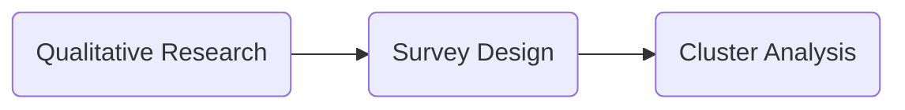

## Targeting
Targeting is the process of selecting the best group/s among the formed segments. This is generally done through market sizing process. Market Sizing is done by estimating TAM, SAM and SOM.


Total Addressable Market is the total number of population that would be willing to buy the similar product/service globally.



Serviceable Available Market is the subset of TAM which the company can reach to. This can be restricted by geography and resources.



Serviceable Obtainable Market is the subset of SAM which company can acquire in a given amount of time. This is restricted by the competition and the percentage of market share the company can acquire.


Example, if one wishes to setup a lemonade shop at locality, 
- **TAM** is the total population that would like to drink lemonade.
- **SAM** will be the areas where the lemonade shop is located, (few kms. around it).
- **SOM** will be the the customers that will most likely come to the shop.



The market sizing estimation can be performed in two ways:
###### Top-Down Approach
1. Start with large population population (TAM) and boil down to smaller population (SOM).
2. If there is a demand constraint of the product, this approach should be preferred. If company can sell to everyone who ask for the product, then Top-Down Approach should be used.
3. Generally approach is used to get monetary estimates.

###### Bottom-Up Approach
1. Start with small-scale dynamics and scale it up to larger population. Example for a retail chain, one can estimate sales in one shop and then scale it up to the entire country. A shopkeeper may start with one week's sales and estimate the sales of the whole year.
2. If there is a supply constraint, this approach should be preferred. Examples are expensive products or products limited by resources.
3. Generally this approach is used to get units estimates.

The blog is incomplete, I'll update it soon...

<!--  -->