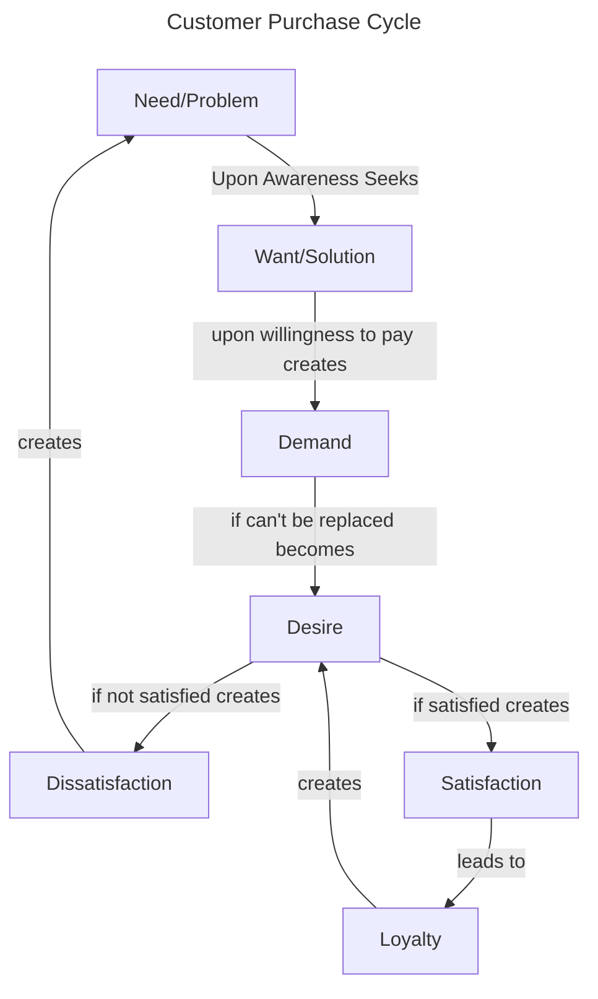

+++
title = "Marketing Basics"
linkTitle = "Marketing"
+++

This whole process of customer up till desire, is governed by the **Value**. Marketer seeks to increase value either by increasing the benefits or decreasing the costs for the customer.

### Here are some definitions:


Need is a problem or dissatisfaction.



Want is a solution to a need/problem.



Demand is a want along with willingness to pay.

Demand = Want + Willingness to pay



Desire is a want that cannot be replaced.

Desire = Want + Can't be replaced



Satisfaction is when expectations meet perceived delivery.

Satisfaction = Expectations - Perceived Delivery

When expectations are greater than perceived delivery, it is called Dissatisfaction.



I will update this blog when I learn the academic definition of Loyalty.



Value is the sum of benefits for the customer minus all the costs he/she has to pay.

Value = ∑Benefits - ∑Costs


### Roles of Marketer
By analyzing this framework, we can easily understand the roles of Marketer.

1. Create Awareness of a Problem/Need.
2. Create solution.
3. Create demand.
4. Convert demand to desire.
5. Match expectations.

I'll be updating this blog as I learn new things.

