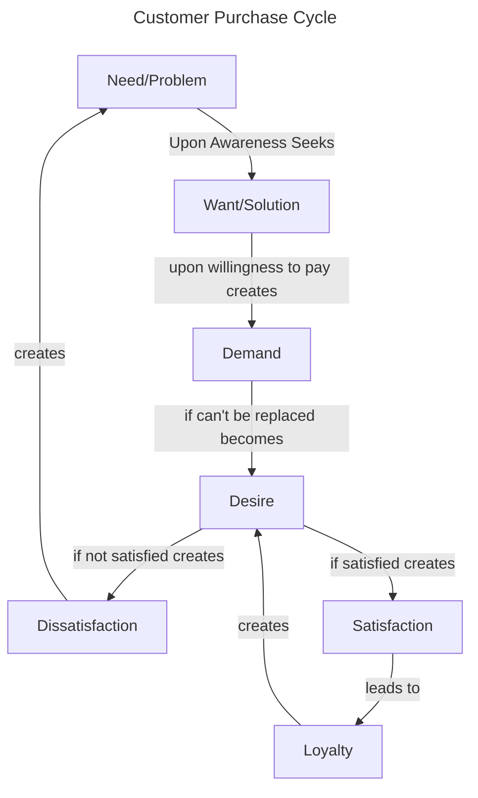
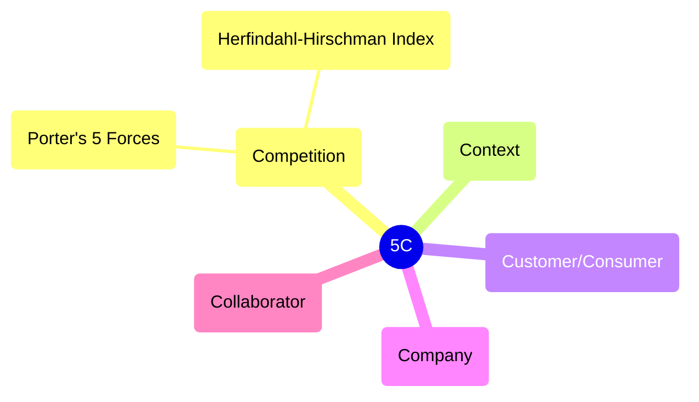
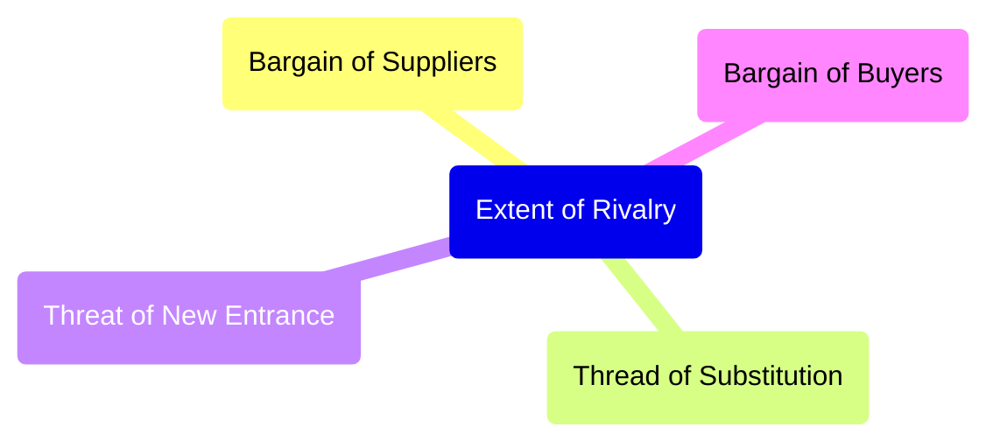

+++
title = "Marketing Basics"
linkTitle = "Marketing"
math = true
+++



This whole process of customer up till desire, is governed by the **Value**. Marketer seeks to increase value either by increasing the benefits or decreasing the costs for the customer.

### Here are some definitions:


Need is a problem or dissatisfaction.



Want is a solution to a need/problem.



Demand is a want along with willingness to pay.

Demand = Want + Willingness to pay



Desire is a want that cannot be replaced.

Desire = Want + Can't be replaced



Satisfaction is when expectations meet perceived delivery.

Satisfaction = Expectations - Perceived Delivery

When expectations are greater than perceived delivery, it is called Dissatisfaction.



When customer want to buy a specific product only, not substitutes.



Customer buys the known brand. This is generally due to inertia of change, when customer is comfortable buying the known brand and doesn't looks at the substitutes.



When customer wants to buy a specific product because of the sense of belonging. The customer chooses a specific product at any cost, this generally happens when customer feels the brand has similar basic values as themselves.



Value is the sum of benefits for the customer minus all the costs he/she has to pay.

Value = ∑Benefits - ∑Costs


### Roles of Marketer
By analyzing this framework, we can easily understand the roles of Marketer.

1. Create Awareness of a Problem/Need.
2. Create solution.
3. Create demand.
4. Convert demand to desire.
5. Match expectations.

I'll be updating this blog as I learn new things.

### Need Gap Analysis
This simple framework can also be used to find out any gaps in markets, if any. The five types of possible gaps are:
1. Lack of *Awareness* of a problem/need
2. Lack of a *Solution* to a known problem/need
3. No good *Value Proposition* for a good solution
4. Possibility of *Value Enhancement*
5. Customer *Expectations* are not being matched 

## Market Scanning Analysis
This is also called Stakeholder Analysis or 5C Analysis. This is basic analysis that any business should do before starting.

Before starting a business, one must check if the business is:
1. Profitable (Competition)
2. Understandable (Customer/Consumer)
3. Feasible (Context)
4. Capable (Company)

### Competition/Profitability Analysis
One Model of analyzing competition/profitability is called *Porter's 5 Forces*. The five forces are:
1. Bargain Power of Supplier
2. Bargain Power of Buyers
3. Threat of Substitution
4. Threat of New Entrance
5. Extent of Rivalry

#### Bargain Power of Buyers
If there are multiple brands with similar value propositions, and very few buyers, ie. supply is greater than demand, the buyers have better power to bargain and ask for better prices. They ask brands to lower prices or they may buy from other brands.

Extreme case is when there is only one buyer and multiple sellers, this market is called Monopsony. One example is market of satellites and missiles. The Government is the only buyer, but there are multiple suppliers.

#### Bargain Power of Sellers
If the raw material a brand uses has very few sellers, sellers can have greater bargain power to increase their costs. They may ask higher prices for the raw materials or they may sell it to other company.

Extreme case is when there is only one seller and multiple buyer, this market is called Monopoly. One example is radio frequency bands which can only be bought through governments.

#### Threat of Substitution
If a new product is launched in the market with better value proposition, the brand may have to reduce their prices to increase their value of product and match it with the new product. (Value = ΣBenefits - ΣCosts)

#### Threat of New Entrance
If new product enters the market, it will start replacing the existing products. To increase the customers, the other brands will try to increase their products value by decreasing prices (assuming it cannot add other benefits). This will make the market less profitable.

#### Extent o Rivalry
Rivalry of market depends of two factors, the number of products and the distribution of market shares. If there are more number of products, it means the market is more competitive. If the market share is evenly distributes amongst all products, means the market is more competitive.

##### Herfindahl-Hirschman Index (HII)
HHI is used to measure the extent of rivalry in a market. The formula of HHI:

$$
 HHI = \sum_{i}(MS_{i})^{2}
$$
$MS$ is Market share of a product.

$ 0 \leq HHI \leq  1 \\ $ if Market Share is in fraction.

$ 0 \leq HHI \leq  10000 \\ $ if Market Share is in percentage.

In simple english, HHI is the sum of square of market share of all the products in the market.

{}
As a general rule of thumb in industry, **HHI > 0.3** is called a less competitive market and hence more profitable, whereas a market with **HHI < 0.3** is said to be more competitive and less profitable.
{}

The blog is incomplete, I'll update it soon...

<!--  -->