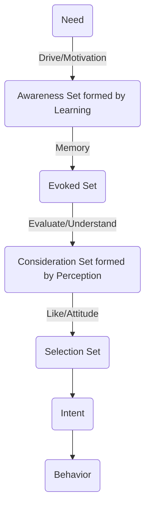
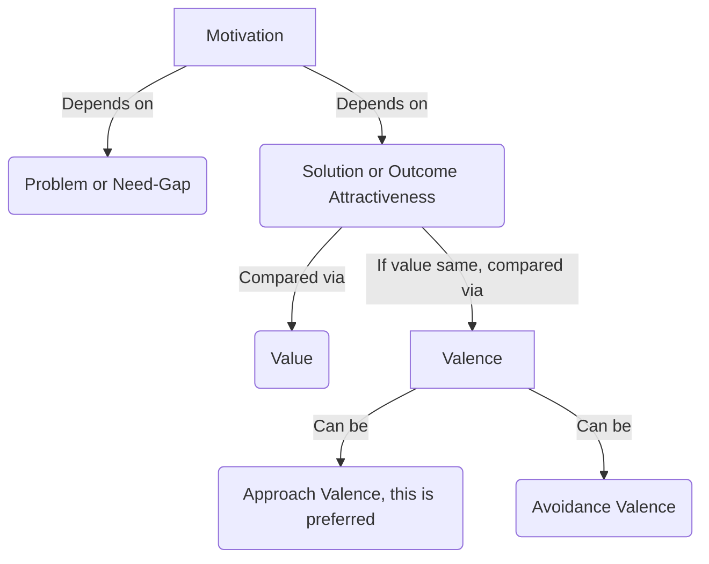
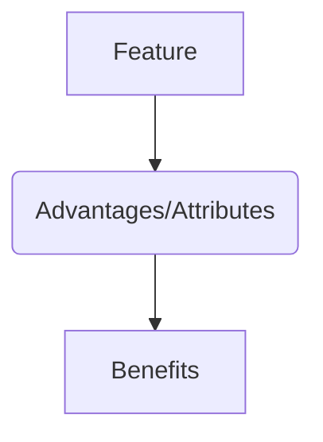
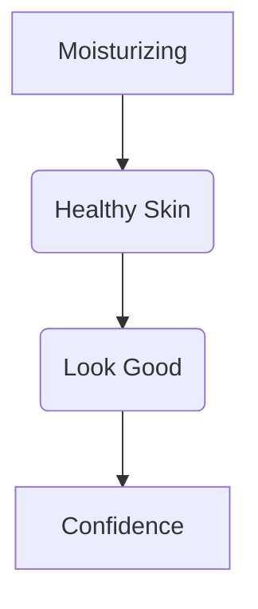
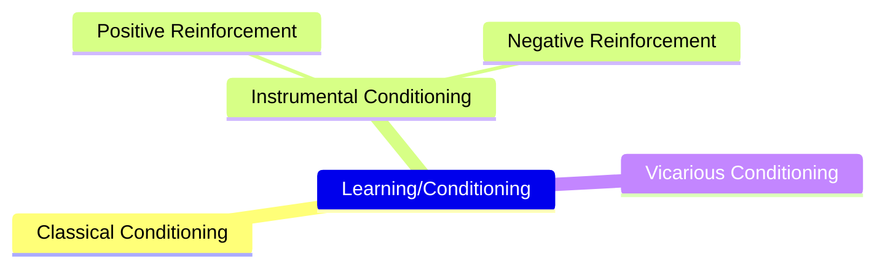
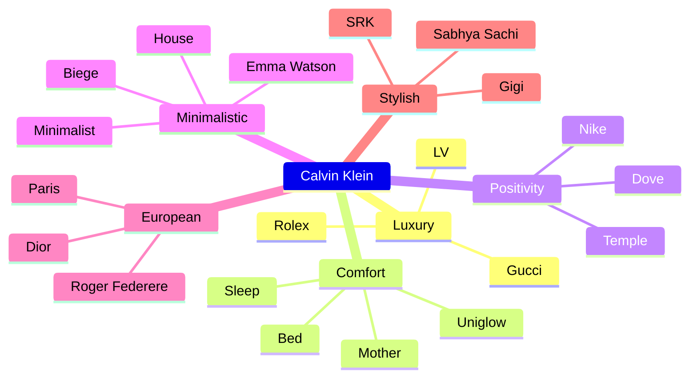
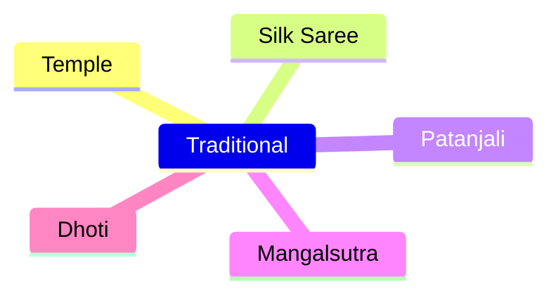
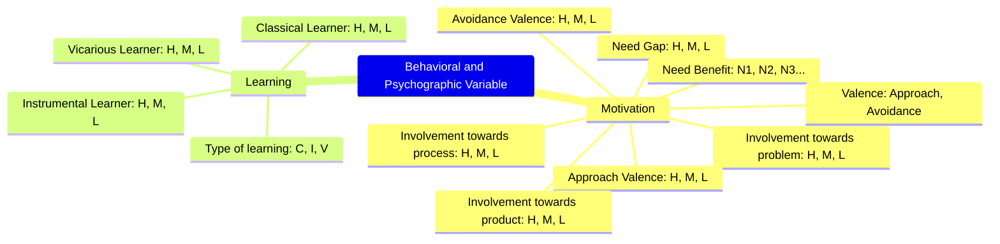

+++
title = "Consumer Behavior"
linkTitle = "Consumer"
math = true
date = "2023-11-21T05:58:51+05:30"
draft = true
weight = 2
+++

In the Segmentation and Targeting process, we need to understand the customers behaviors. We will do it by collecting data about the psychographic Behavioral and Psychographic variables.

Preference = Behavioral + Psychographic Variables

## Consumer Decision Making




Consumptions that can be consumed once a lifetime. Eg: funeral services, appendicitis surgery.


This whole process depends upon:
1. Personality
2. Culture

### Motivation
Everyone wants to stay in a state of comfort (ideal state). The gap between ideal state and current state is called need gap. Need-Gap gives rise to motivation.



Motivation is derived from motive which means to move. Motivation can be considered as a force.

Motivation depends on two things:
1. Problem (Push, Need Gap)
2. Solution (Pull, Outcome Attractiveness)

Eg. if someone has mild dandruff, he/she may not be even looking for solutions. But if the dandruff is high, then the person would be *motivated* to look for solution. On the other hand, if there is any shampoo that makes hair more stylish and smooth, then the solution itself is attractive, hence people are motivated to purchase it.

Customers compare solutions first through cost-benefit analysis, i.e. comparing value. If two solutions provide same value, then comparison is made using something called Valence.

#### Valence

Direction of drive/motivation.


Valence can be towards:
1. Product
2. Process
3. Problem

Examples:

This is an example of avoidance valence advertisement.


This is an example of avoidance valence advertisement.


This is an example of avoidance valence advertisement.


This is an example of approach valence advertisement.


The example has both aspects, starts with avoidance then ends with approach valence.


The example is of approach valence.

>If the values are equal, then engagement is more with approach valence advertisements. Marketers should try to create advertisements that are more approach valence.


Purchases that happen unwillingly out of necessity. Examples are condoms and insurances.


#### Motivational Conflicts
1. **Approach-Approach Motivational Conflict**: This occurs when customer has same value and valence for both products. When he/she chooses any one product, he/she experiences something called *Buyer's Remorse* or *Consumer Regret*. The perceived value of the purchased product reduces and the perceived value of the other product increases. To resolve this conflict, marketer must give assurance and feedback to reduce buyer's remorse.
2. **Approach-Avoidance Motivational Conflict**: This occurs when consumer wants the end result but dislikes the process of getting there. Example maggi is tasty but unhealthy. This can be resolved by changing marketing message like Aata Noodles introduced by maggi.
3. **Avoidance-Avoidance Motivational Conflict**: When customer want to avoid both the end goal and process, it is called Avoidance-Avoidance Conflict. Eg. people don't want to get obese and don't want to exercise, the VLCC came up with cream to remove fat. Eg. I don't want face marks and don't want to have surgery, then nomarks cream came to solve the problem.

Process of quantifying valence is called **Laddering** or **Hierarchal Value Map** or **Terminal Value Map**. We'll learn this in Market Research module. Theoretically, this is done through **FAB Analysis**.
Feature, Advantages and Benefits.

Example if you want to purchase a laptop, features will be RAM, processor etc. Advantages will be fast computing. Benefits will be play games without lag. Customers talk at the feature level, but think at the benefits level. Marketer must understand the benefits that customers need.

In laddering process, we need to ask Why question in each step and figure out the terminal benefit the customer is seeking. Example of a cream, the customer may ask for a moisturizing cream because she wants a healthy skin. She wants a healthy skin to look good. She wants to look good because she wants to feel confidence. Because of this, fair and lovely always emphasizes on confidence rather than moisturization or any other feature.

## Learning

Learning is also called conditioning. There are three types of conditioning:
1. **Classical Conditioning**: Learning through Ads.
2. **Instrumental/Operational Conditioning**: Learning by doing. This is the most effective form of learning.
3. **Vicarious Conditioning**: Learning from other's experience.

### Classical Conditioning
Experiments were conducted by Ivan Pavlov.

In experiment, he gave food to dogs, the dogs salivated. He rang a bell, the dogs showed no response. Then he gave rang the bell then gave the food for two months. Then he just rang the bell without giving food, the dogs still salivate.

He generalized the theory that when an Neutral Stimulus (bell) is combined with an Unconditional Stimulus(food) for some time, the Unconditional Response (salivation) is triggered also with Neutral Stimulus. Eg. Hungry Kya => Snickers, Thanda Matlab => Coca Cola.

This is an example of classical conditioning.



In the advertisement, conditioning is done through Beethoven Symphony.

In the advertisement, conditioning is done through Beethoven Symphony.

All the brand elements can be used for classical conditioning like taglines, logo, jingles etc.
### Instrumental/Operational Conditioning
This is also called Operand Learning Technique. B. F. Skinner did experiments with rats. There are two ways to condition, positive reinforcement and negative reinforcement.

This clip explains the learning by doing conditioning.

Example is cashbacks, BOGO offers, test drives.

This was an example of positive reinforcement.


These were examples of negative reinforcement.

### Vicarious Conditioning
Also called slice of life advertisement. Vicarious learning is often done through brand ambassadors. This is also called observational learning.





## Memory
Memory is of two types:
1. Short Term Memory (Episodic Memory)
2. Long Term Memory

Long term memory has associations to certain stimulus which allows them to be recalled easily. The process of converting a short term memory to long term memory is called encoding. It if often done using brand elements like brand tags, jingles, logos etc. The process to retrieving long term memory through stimulus is called decoding. There can be multiple stimuli that brand use for recall.
> Consumer experiences are also example of stimuli.  

> Evoked set is also effected by Recency Effect.



### Schema/Associated Network
Schema defines structure of memory.

Whenever a need arises, consumers think of attributes, not solutions. Then consumers look for solutions attached to the attributes.

Patanjali has strongly attached itself with the traditional node, hence it is the POP of the brand. Whereas it keeps itself away from the modern node, hence it is POD of the brand.

# List of Behavioral and Psychographic variables

