+++
title = "Consumer Behavior"
linkTitle = "Consumer"
math = true
date = "2023-11-21T05:58:51+05:30"
draft = true
weight = 2
+++

In the Segmentation and Targeting process, we need to understand the customers behaviors. We will do it by collecting data about the psychographic Behavioral and Psychographic variables.

Preference = Behavioral + Psychographic Variables

## Consumer Decision Making




Consumptions that can be consumed once a lifetime. Eg: funeral services, appendicitis surgery.


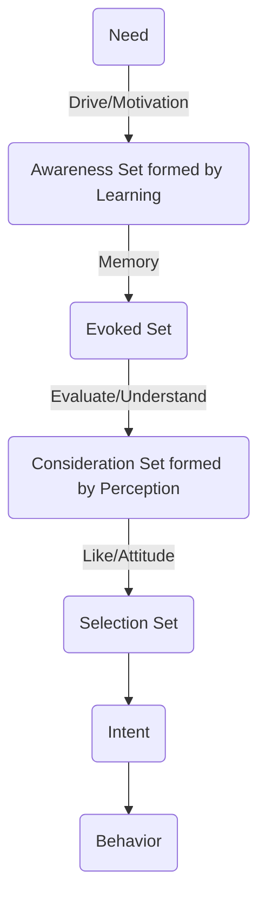
This whole process depends upon:
1. Personality
2. Culture

### Motivation
Everyone wants to stay in a state of comfort (ideal state). The gap between the ideal state and the current state is called the need gap. The need gap gives rise to motivation.



Motivation is derived from motive which means to move. Motivation can be considered as a force.

Motivation depends on two things:
1. Problem (Push, Need Gap)
2. Solution (Pull, Outcome Attractiveness)

Eg. if someone has mild dandruff, he/she may not be even looking for solutions. But if the dandruff is high, then the person would be *motivated* to look for a solution. On the other hand, if there is any shampoo that makes hair more stylish and smooth, then the solution itself is attractive, hence people are motivated to purchase it.

Customers compare solutions first through cost-benefit analysis, i.e. comparing value. If two solutions provide the same value, then the comparison is made using something called Valence.

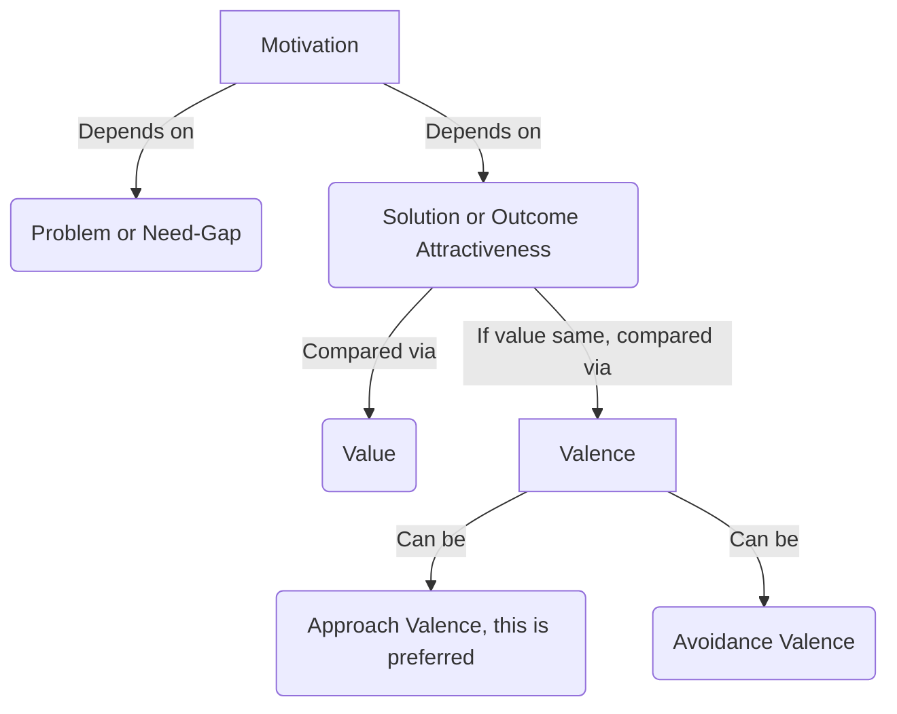

#### Valence

Direction of drive/motivation.


Valence can be towards:
1. Product
2. Process
3. Problem

Examples:

- [Krack Heel Repair New Ad 2014 Salesmen OFFICAL HD](https://www.youtube.com/watch?v=FGVgbuD_3ew):
This is an example of an avoidance valence advertisement.

- [Itch Guard](https://www.youtube.com/watch?v=LcW_pS7egq0):
This is an example of avoidance valence advertisement.

- [Colgate Total Pro Gum Health Ad English](https://www.youtube.com/watch?v=O6TyQDh0IlM):
This is an example of avoidance valence advertisement.

- [Close Up TV Commercial (2) - Paas Aao Na - Lintas, BLUE i & MOKKSHA](https://www.youtube.com/watch?v=SRKs0emTPI0):
This is an example of approach valence advertisement.

- [Pension Plans - HDFC Standard Life Insurance - Sar Utha Ke Jiyo](https://www.youtube.com/watch?v=golj0-ucS_o):
The example has both aspects, starting with avoidance then ending with approach valence.

- [Apne Parivar Ko Apne Dum Pe Jeena Sikhao](https://www.youtube.com/watch?v=dsNAWGOBUBI):
The example is of approach valence.

>If the values are equal, then engagement is more with approach valence advertisements. Marketers should try to create advertisements that are more approach valence.


Purchases that happen unwillingly out of necessity. Examples are condoms and insurance.



#### Motivational Conflicts
1. **Approach-Approach Motivational Conflict**: This occurs when a customer has the same value and valence for both products. When he/she chooses any one product, he/she experiences something called *Buyer's Remorse* or *Consumer Regret*. The perceived value of the purchased product reduces and the perceived value of the other product increases. To resolve this conflict, marketers must give assurance and feedback to reduce buyer's remorse.
2. **Approach-Avoidance Motivational Conflict**: This occurs when a consumer wants the end result but dislikes the process of getting there. For example, Maggi is tasty but unhealthy. This can be resolved by changing the marketing message like Aata Noodles introduced by Maggi.
3. **Avoidance-Avoidance Motivational Conflict**: When customer want to avoid both the end goal and process, it is called Avoidance-Avoidance Conflict. Eg. people don't want to get obese and don't want to exercise, the VLCC came up with cream to remove fat. Eg. I don't want face marks and don't want to have surgery, then nomarks cream came to solve the problem.

Process of quantifying valence is called **Laddering** or **Hierarchal Value Map** or **Terminal Value Map**. We'll learn this in Market Research module. Theoretically, this is done through **FAB Analysis**.
Feature, Advantages and Benefits.

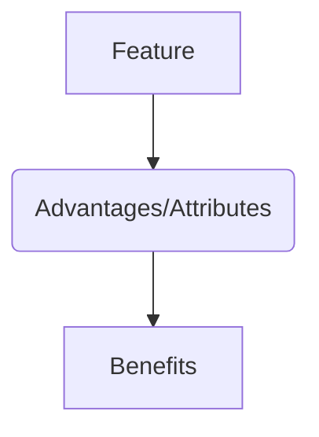
Example if you want to purchase a laptop, features will be RAM, processor etc. Advantages will be fast computing. Benefits will be play games without lag. Customers talk at the feature level, but think at the benefits level. Marketer must understand the benefits that customers need.

In laddering process, we need to ask Why question in each step and figure out the terminal benefit the customer is seeking. Example of a cream, the customer may ask for a moisturizing cream because she wants a healthy skin. She wants a healthy skin to look good. She wants to look good because she wants to feel confidence. Because of this, fair and lovely always emphasizes on confidence rather than moisturization or any other feature.
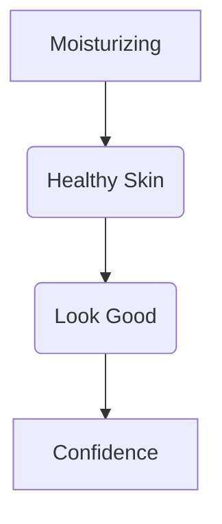

## Learning
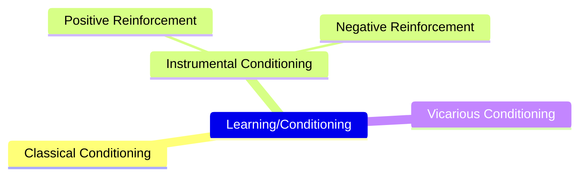

Learning is also called conditioning. There are three types of conditioning:
1. **Classical Conditioning**: Learning through Ads.
2. **Instrumental/Operational Conditioning**: Learning by doing. This is the most effective form of learning.
3. **Vicarious Conditioning**: Learning from other's experience.

### Classical Conditioning
Experiments were conducted by Ivan Pavlov.

- [Pavlov’s Classical Conditioning](https://www.youtube.com/watch?v=jd7Jdug5SRc):
In experiment, he gave food to dogs, the dogs salivated. He rang a bell, the dogs showed no response. Then he gave rang the bell then gave the food for two months. Then he just rang the bell without giving food, the dogs still salivate.

He generalized the theory that when an Neutral Stimulus (bell) is combined with an Unconditional Stimulus(food) for some time, the Unconditional Response (salivation) is triggered also with Neutral Stimulus. Eg. Hungry Kya => Snickers, Thanda Matlab => Coca Cola.

- [Best Ad by Aamir Khan... For Coke.. As Punjabi Jatt](https://www.youtube.com/watch?v=QmdZbNMowkE):
This is an example of classical conditioning.

- [Aamir Khan Coke AD](https://www.youtube.com/watch?v=QZWgamF8YwA)
- [Old Indian Ads -Indian TV Classic Funny ECE Bulb Commercial](https://www.youtube.com/watch?v=PGPbsdohmqQ)

- [Titan Watches: Advertisement (Wedding)](https://www.youtube.com/watch?v=SvRx1C0oxOQ):
In the advertisement, conditioning is done through Beethoven Symphony.

- [TITAN -The Joy of Gifting](https://www.youtube.com/watch?v=PQxFL6Ce-XM):
In the advertisement, conditioning is done through Beethoven Symphony.

All the brand elements can be used for classical conditioning like taglines, logo, jingles etc.
### Instrumental/Operational Conditioning
This is also called Operand Learning Technique. B. F. Skinner did experiments with rats. There are two ways to condition, positive reinforcement and negative reinforcement.

- [Positive Reinforcement - The Big Bang Theory](https://www.youtube.com/watch?v=JA96Fba-WHk):
This clip explains the learning by doing conditioning.

Example is cashbacks, BOGO offers, test drives.

- [KFC Classics: Buy One Get One Free](https://www.youtube.com/watch?v=B5t-w600TwU):
This was an example of positive reinforcement.

- [Stayfree All Night Whistle Tvc](https://www.youtube.com/watch?v=PC4b4OIIk3Y):
- [NIVEA SUN introduces Mr Sun – "There's only one sun"](https://www.youtube.com/watch?v=kr-p68vHio0):
These were examples of negative reinforcement.

### Vicarious Conditioning
Also called slice of life advertisement. Vicarious learning is often done through brand ambassadors. This is also called observational learning.

- [This slice of life Amul ad is about the everyday drama of a typical Indian family.](https://www.youtube.com/watch?v=cFFx97rHvE0)
- [Surf Excel Lalitaji](https://www.youtube.com/watch?v=ALxiXkHxqCc)
- [surf lalitaji commercial](https://www.youtube.com/watch?v=CN_plnOolf8)
- [Take the Dove half-face test and feel the Dove difference! (English)](https://www.youtube.com/watch?v=j5ABkEX9wJ8)

## Memory
Memory is of two types:
1. Short Term Memory (Episodic Memory)
2. Long Term Memory

Long term memory has associations to certain stimulus which allows them to be recalled easily. The process of converting a short term memory to long term memory is called encoding. It if often done using brand elements like brand tags, jingles, logos etc. The process to retrieving long term memory through stimulus is called decoding. There can be multiple stimuli that brand use for recall.
> Consumer experiences are also example of stimuli.  

> Evoked set is also effected by Recency Effect.



### Schema/Associated Network
Schema defines structure of memory.
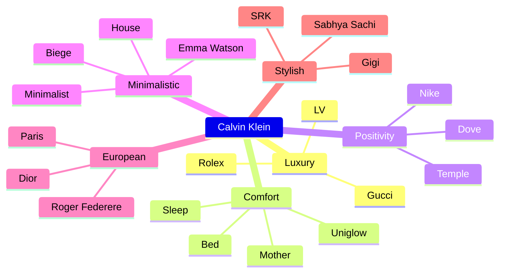
Whenever a need arises, consumers think of attributes, not solutions. Then consumers look for solutions attached to the attributes.

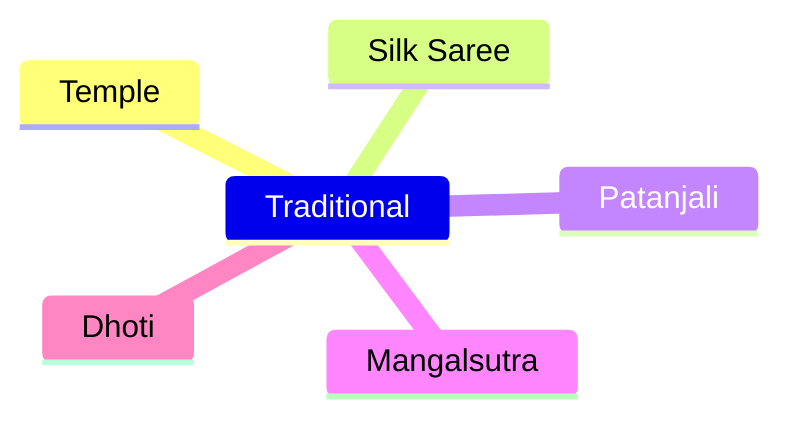
Patanjali has strongly attached itself with the traditional node, hence it is the POP of the brand. Whereas it keeps itself away from the modern node, hence it is POD of the brand.

This can be used to identify POP and POD.

It can also be used create Brand Extension. Example, a brand called BIC create pen, razors, staplers. It tried to market perfume, but failed because the brand was attached to disposable/convenience node, but perfume cannot be attached to disposable node hence it failed.

Example Kamasutra brand creates condoms and is attached to sexy/attractiveness/indulgence node. Hence it can extend to perfume, lipstick etc.

## Personality
Personality is "who you are?" or the self. There can be three personality types:
1. **Compliant**: Follows rules, desire to belong
2. **Aggressive**: Achievement & success, need for esteem, power
3. **Detached**: break the rules, need for self-actualization

Since people like to form connections with people with similar personality, therefore brands try to portrait certain personality to attract specific type of customers. If brand doesn't has a personality, it cannot have a high involvement purchase.

### Examples of aggressive personality
- [Stella Artois - Quest](https://www.youtube.com/watch?v=-D01M9Tlyqg)
- [NANDU BRAND ELITE WASHED LUNGIES](https://www.youtube.com/watch?v=ns2KeatnIaQ)
### Examples of compliant advertisements
- [Summer Corona Commercial 2017](https://www.youtube.com/watch?v=MYcA7t8O7b0)
- [Share A Coke campaign 2019](https://www.youtube.com/watch?v=sGjQnGio5mw)
This is an example of advertisement targeting compliant personality.
### Examples of detached advertisement
- [Carlsberg Commercial 2015 HD If did fitting rooms](https://www.youtube.com/watch?v=dAAy1cT89s4)
- [7UP Fido Dido Classic Indian TV Ad//Other 7UP (Fido Dido) Old Commercial](https://www.youtube.com/watch?v=hJIPF29ta3A)
- [Sprite (Seedhi Baat, No Bakwaas)](https://www.youtube.com/watch?v=hyeU2lTpgrk)
### Example of confused advertisement
- [999 Lungi Ad](https://www.youtube.com/watch?v=nofXbdTXmS8)

Apple has always been consistent with catering to detached personality (geeky guys). Nike also has stood consistent with message anybody can run, which appeals to detached personality.

[Nike - Just Do It (1988) - Very first commercial](https://www.youtube.com/watch?v=0yO7xLAGugQ)

{}
Brands can change personality over time.
{}


To explain behaviors different from personality, concepts of *Multiphrenic Self* and *Personality traits* are used.

Personalities can change when a life-transforming event happens life death of loved one, birth of child, marriage.

### Multiphrenic Self


How the person is when he/she is alone without any external influence.



Who the person wants to be.



What others think about the person.



What person wants others to think he/she is.


Malboro displayed cigarettes as used by macho cowboys, so the young males who wanted to display themselves as macho, started consuming it.
- [Marlboro Advertisement 1985](https://www.youtube.com/watch?v=zi1O_Y7vWxU):
Sadly, south Indian actors also promote cigarettes.
- [Rajini Cigarette style compilation part 1 | #Rajini Style](https://www.youtube.com/watch?v=_XXkz9_2hdM):

Now a days, heros are displayed as having six-pack abs, hence the young generation is getting to gym.

Raymonds also used "The Complete Man" tagline to make customers get interested in their products.
- [Raymond - The Complete Man](https://www.youtube.com/watch?v=2hv42havE4w):

{}
A good book on personality is "Presentation of Self in everyday life", by Goffmann.
{}

### Personality Trait
Personality traits are mostly inborn. There are in total 70+ personality traits, we'll discuss 10 of them:
1. Consumer Innovativeness
2. Variety Novelty Seeking behavior
3. Dogmatism
4. Need for Cognition
5. Consumer Ethnocentrism
6. Verbalization
7. Visualization
8. Outer Directedness
9. Inner Directedness
10. Optimal Stimulation Level

These personality traits are not orthogonal, i.e. they are not opposite of each other.

{}
**Consumer Behavior by Solomon** and **Consumer Behavior by Schiffmann & Kanuk** are good books to understand personality traits.
{}

{}
Book by Robert Kalgini has a different thought process on consumer behavior.
{}

#### Consumer Innovativeness
When consumer uses the product in different ways.
- [Never seen before: Making lassi in washing machine to combat heatwave!](https://www.youtube.com/watch?v=jRcklcCaEJU):
- [Top 10 Awesome Toothpaste Life Hacks](https://www.youtube.com/watch?v=k83cJcWSmiw):

#### Variety Novelty Seeking Behavior
When consumers seek new products or features.

#### Dogmatism
When consumers have certain believes. Example boiling water. Dogmatism can be tackled only when there is an ambassador or person of authority. For example when people of FATA had believes that the polio drops would make children impotent, WHO appealed to Imams to convince disciples to get polio drops.

- [Dressing Room - Rahul Dravid (Heroes Project PSA, HIV awareness and Prevention)](https://www.youtube.com/watch?v=vkGCg7K4cdk):

#### Need for Cognition
Cognos means knowledge. Consumers who wants to know a lot of things about are the consumers with high need for cognition.

#### Consumer Ethnocentrism
Ethno means group, centrism means towards.

Ethnocentrism is different from Country of Origin Effect. Eg. if a car is made in Germany, and I believe that automobile technology in German is superior, then purchasing a German car is an example of Country of Origin Effect. But if I am German, therefore I'll purchase only German car, this is Ethnocentrism.

Country of Origin Effect must have a place which has a history of superior products. This is also called Provenance Effect.

{}
Provenance is also called 8th P. If one wants to have a luxury brand, provenance is also essential.
{}


{}
Study of watches is called Horology.
{}

Switzerland is popular for it's watches because during French Revolution, Breguet and other watch makers took shelter in Switzerland.

{}
Switzerland is considered as a neutral country because it never participated in any world war.
{}

{}
If there is no Provenance Effect, the brand cannot be called as *luxury* brand, it can be considered *premium* brand but not *luxury* brand.
{}


Another example if I believe that Silk Sarees from Kanchipuram are good, then I purchase Kanchipuram saree, this is Country of Origin Effect, whereas if I purchase Kanchipuram saree because I am from Kanchipuram, this is an example of Ethnocentrism.

If consumer buys products from people of his/her community, this is an example of Ethnocentrism.

#### Verbalization
Ability to comprehend things through words. If customers are high on verbalization, one should advertise through newspapers articles, magazines articles etc.

#### Visualization
Ability to comprehend things through pictures. If customers are high on visualization, the advertisement must be done through images in billboards, newspapers etc.

#### Outer Directedness
Desire to look good in the eyes of others.
- [ONIDA TV Devil old doordarshan Ad - 90'sAdvertisement/commercial](https://www.youtube.com/watch?v=oGWP1idJxD8):
Onida advertisement states lots of features, they cater to people with high need for cognition and outer directedness both.

#### Inner Directedness
Consuming something to please oneself.

#### Optimal Stimulation Level
Each person has an internal frequency, i.e. how active lifestyle he/she likes. There is also environmental frequency, i.e. environment demands certain activity level. Eg. if a person from Shimla, where lifestyle has very low OSL (Optimum Simulation Level) is brought to Mumbai, where lifestyle has high OSL, then the person would feel irritated and will seek for environment with low OSL.

This is generally used by tourism industry.
- [Visit Maldives](https://www.youtube.com/watch?v=rBDC7_BnLH4):
This advertisement caters to both personalities with high OLS and low OSL.

## Perception
Perception = Understand + Evaluate

Perception = Stimulus Organization + Stimulus Interpretation

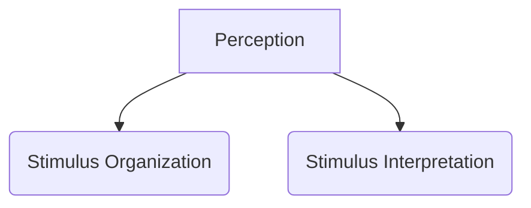

If stimulus is there and the observer ignores the stimulus and no reaction is shown, this is called perceptual barrier.






### Marketer's Techniques

Depending on the context, there is a differential threshold which which if crossed grabs the customer's attention, else customer ignores it. Just Noticeable Difference is the amount of change required to grab attention.

If marketer wants to show something, they keep it above JND, if marketer wants to hide something, they make it below JND. Eg. when lays wants increase the amount of lays added, since they difference in weight is unnoticeable, they increase the size of packet and put large observable label of "20% Extra".


5-star reduced the quantity of chocolate gradually, keeping the changes lower than JND. First they kept packet size same just shaved off chocolate. Then they reduced packet size to meet the chocolate size. Over time, the size of chocolate has reduced a lot and introduced another variety of chocolate priced at Rs. 10.


Earlier Jim-Jam had 3 biscuits. The company reduced the size of biscuits gradually. After some time, instead of having three small biscuits, they packaged 2 big biscuits for same price.


Parle-G had 100gm biscuit of Rs. 4. Then it decided to increase the price to 5. In 2 months, it lost 70% of Market share because the change was above JND. So they reverted back the price and reduced the quantity of biscuit gradually to 35gm today.


JND can be done for all senses. Eg. mutual funds are subjected to market risks are said fast to keep it below JND.

JND can be used in three ways:
1. **Figure and Ground**: The figure can merge with the ground or stand out of ground.
The below images demonstrate this technique. San-Diago has the largest zoo and is famous for it. The zebra image has the bottle image in it. Absolut is a vodka brand which advertised itself using this technique.




In music also, if piano is played loudly than other instruments, it stands out.
In food if one flavour has strong smell or taste, this is also an example of figure and ground.
Guerilla Advertisements are examples of figure and ground.
2. **Grouping**: Trying to create a whole using parts.

3. **Closure**: If first and the last words are same, you read it as something you already know.


Other examples are there is a brand called Nima which looks similar to Nirma, there is also a brand called London Britches which can be interpreted as London Bridges or London Bitches. 

#### Utility Consideration
Total Utility = Acquisition Utility + Transaction Utility

Every customer has an internal reference price, and there is an external reference price.

Example, on a special day, suite-case with MRP 15000 is being sold for 6000, customers think that the total utility they got is the worth of the suite-case (15000) plus the savings they did (9000).
Total perceived utility = 15000 + 9000  = 24000

Transaction utility can be in the other forms also, by serving with smile.

Baskin Robins is a good strategy, they give 50% discounts on 31st every month.

Overdoing the price reduction strategy is harmful for brand. If price is reduced everyday, consumers will feel cheated and ignore the price. Like Boat always shows discounts, so people start ignoring the price.


### Consumer's Reactions
 Consumers use 4 techniques to organize attention:
 1. Selective Attention: Paying more attention to specific information.
 2. Selective Exposure: Actively seeking specific knowledge.
 3. Perceptual Blocking: Filter out/ignoring the stimuli. Example ignoring the advertisement on the cigarette packet.
 4. Perceptual Defense: Actively denying the stimuli. For example justifying cigarette by giving examples of others who smoke and are still healthy.

Selective Attention and Selective Exposure thins the perception barrier. Perceptual blocking and Perceptual defense are used to harden the perception barrier.

### Assimilation Contrast Theory
Customer has an expected price range. If the product he/she finds is in the expected range, it gets into its assimilation zone. If the product is slightly expensive, it is said to be in High Plausible Zone. If the product is slightly lower than the range, it is said to be in Lower Plausible Zone. If the product is too expensive than the expected range, it is considered to be some different product and said to be in High Implausible Zone. If the product is of much cheaper price than the expected price, it is assumed to be some other product and said to be in Lower Implausible Zone.

Being in the Assimilation Zone, Lower Plausible Zone or Higher Plausible Zone creates a POP for the product. Being in High Implausible Zone or Low Implausible Zone creates a POD for the product.



## Attitude

Learned opinion or formed disposition.


There should first be positive attitude towards consumption. After having positive opinion towards consumption, there should be a positive attitude towards product category. When there is positive attitude towards production category, then marketer should try to create positive attitude towards brand.

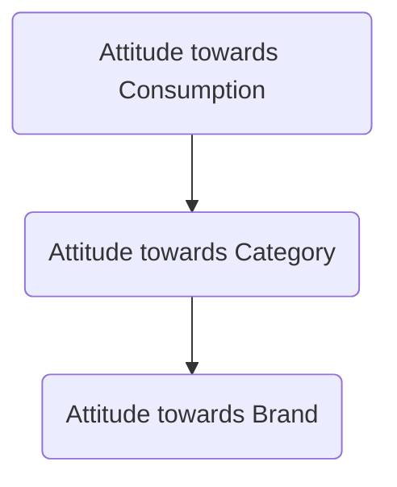


Creating awareness towards consumption.


{}
Attitude can change with experience and context (situation).
{}

### Why attitude is formed?
- **Utilitarian Function**: Transactional function, where one likes something because it fulfils a utility
- **Ego-Defensive Function**: Likes something because it protects one from a problem.
- **Value-Expressive Function**: Also called **Self-Expressive Function**. Like something because one can relate to it and have a sense of self attached to it.

Involvement is highest for the Value-Expressive Function and least for the Utilitarian Function. 

### Tri-Component Model of Attitude

Tri-Component Model of Attitude suggests there are three components of forming an attitude:
- Cognition (Know)
- Affect (Feel)
- Conation/Behavior (Do)

#### High Involvement Purchase
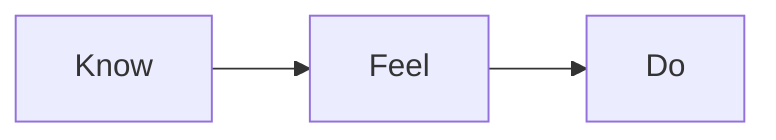
#### Low Involvement Purchase
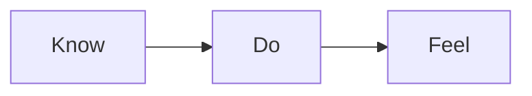
#### Impulse Purchase
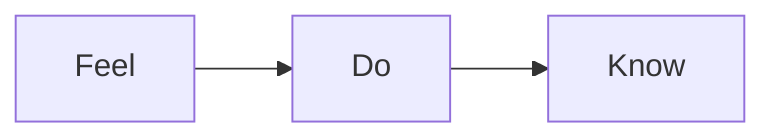

# List of Behavioral and Psychographic variables
## Motivation
1. Need Gap: H, M, L
2. Need Benefit: N1, N2, N3...
3. Individual Need Benefit Involvement: H, M, L
4. Involvement towards problem: H, M, L
5. Valence: Approach, Avoidance 
6. Approach Valence: H, M, L 
7. Avoidance Valence: H, M, L 
8. Involvement towards product: H, M, L
9. Involvement towards process: H, M, L
## Learning
10. Type of learning: C, I, V 
11. Effectiveness of Classical Learning: H, M, L 
12. Effectiveness Instrumental Learner: H, M, L 
13. Vicarious Learner: H, M, L 
14. Effectiveness of +ve reinforcement: H, M, L 
15. Effectiveness of -ve reinforcement: H, M, L 
## Personality
16. Personality type: C, A, C 
17. Exhibition of Aggressive personality: H, M, L 
18. Exhibition of Compliant personality: H, M, L 
19. Exhibition of Detached personality: H, M, L 
20. Exhibition of Actual Self: H, M, L 
21. Exhibition of Ideal Self: H, M, L 
22. Exhibition of Social Self: H, M, L 
23. Exhibition of Ideal Social Self: H, M, L 
24. Consumer Innovativeness: H, M, L 
25. Variety Novelty Seeking behavior: H, M, L 
26. Dogmatism: H, M, L 
27. Need for Cognition: H, M, L 
28. Consumer Ethnocentrism: H, M, L 
29. Verbalization: H, M, L 
30. Visualization: H, M, L 
31. Outer Directedness: H, M, L 
32. Inner Directedness: H, M, L 
33. Optimal Stimulation Level: H, M, L 
34. Provenance Effect: H, M, L
## Perception
35. Selective Attention: H, M, L 
36. Selective Exposure: H, M, L 
37. Perceptual Blocking: H, M, L 
38. Perceptual Defense: H, M, L 
39. Transaction Utility: H, M, L
## Attitude
40. Attitude Towards Consumption: H, M, L
41. Attitude Towards Product Category: H, M, L
42. Attitude Towards Brand: H, M, L
43. Attitude Towards Product: H, M, L
44. Attitude Towards Process: H, M, L
45. Attitude Towards Brand Ambassador: H, M, L
46. Attitude Towards Brand Owner: H, M, L
47. Utilitarian Attitude: H, M, L
48. Ego Defensive Attitude: H, M, L
49. Value Expressive Attitude: H, M, L

<!-- ```mermaid
mindmap
    Bohobamboo
        Durable
        Eco-friendly
        Beautiful
        Affordable
        Trending
        Cultural Heritage
``` -->