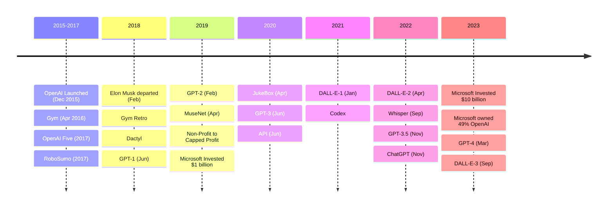

+++
title = "History of OpenAI"
linkTitle = "History"
+++

## Launch
OpenAI started as a non-profit on 11 Dec 2015. It was founded by:
1. **[Ilya Sutskever](https://www.linkedin.com/in/ilya-sutskever/)**: Did Postdoc at Stanford University. One of the leading researchers in the field of Deep Learning. Worked on Google Brain and TensorFlow. Co-Founder and Research Director at OpenAI.
2. **[Greg Brockman](https://www.linkedin.com/in/thegdb/)**: Studied Computer Science at MIT and Harvard. Served as CTO of Stripe for 5 years. President, Chairman and Co-Founder of OpenAI.
3. **[Trevor Blackwell](https://www.linkedin.com/in/trblackwell/)**: Did PhD in Computer Science at Harvard. Worked in Yahoo, and served as CEO of Anybots Inc. He is a researcher at OpenAI and Y Combinator Partner.
4. **[Vicki Cheung](https://www.linkedin.com/in/vickicheung/)**: Founding Engineer of Duolingo. Was a founding engineer at OpenAI. She is the Co-Founder and CTO of Gantry.
5. **[Andrej Karpathy](https://www.linkedin.com/in/andrej-karpathy-9a650716/)**: Research intern with Google. Ph.D. in Computer Science from Stanford. Was a founding member and research scientist at OpenAI. Served as Senior Director of AI at Tesla.
6. **[Durk Kingma](https://www.linkedin.com/in/durk-kingma-58b3564/)**: Research Scientist and Team Lead at OpenAI. Working as a research scientist at DeepMind.
7. **[Wojciech Zaremba](https://www.linkedin.com/in/wojciech-zaremba-356568164/)**: Has been a Research Scientist at Google and Facebook. Currently co-founder of OpenAI.
8. **[John Schulman](http://joschu.net/)**: A research scientist and co-founder of OpenAI.
9. **[Sam Altman](https://en.wikipedia.org/wiki/Sam_Altman)**: Served as president of Y-Combinator. CEO of OpenAI.
10. **[Elon Musk](https://en.wikipedia.org/wiki/Elon_Musk)**: CEO of SpaceX and Tesla. Co-Founder of Neuralink, OpenAI, Zip2 and X.com.
11. **[Peter Thiel](https://www.linkedin.com/in/peterthiel/)**: Served as CEO, Chairman and Co-Founder of PayPal. Member of the Board of Directors at Facebook. A popular venture capitalist. Invested in OpenAI.
12. **[Jessica Livingston](https://www.linkedin.com/in/jessicalivingston1/)**: Partner at Y-Combinator. One of the initial investors in OpenAI.

Companies like AWS, Infosys, Microsoft and YC Research also supported OpenAI when it was founded. Everyone collectively pledged over $1 billion to the venture but only $130 million was contributed until 2019. Elon Musk was the greatest contributor.

In Feb 2018, Elon Musk departed from the company stating the conflict of interest with the AI research going on at TESLA. In 2019, due to a crunch in capital, OpenAI transformed from a non-profit to a capped-profit company. Now, investors can receive a maximum of 100 times their investment. Also, OpenAI received $1 billion in funding from Microsoft. In 2023, Microsoft funded OpenAI with $10 billion and now owns 49% of the company.

## Contributions
OpenAI has developed several notable models and technologies in the field of artificial intelligence. Here's a list of some of the key models:
1. **Generative Pre-trained Transformer (GPT) Series**: 
   - **GPT-1**: The original generative pre-trained transformer model.
   - **GPT-2**: An improved version with significantly more parameters, known for its ability to generate coherent and contextually relevant text.
   - **GPT-3**: A further advancement with 175 billion parameters, demonstrating remarkable language understanding and generation capabilities.
   - **GPT-4**: The latest iteration with even more advanced capabilities, capable of accepting text or image inputs.
2. **DALL-E Series**:
   - **DALL-E**: A variant of the GPT-3 model designed to generate images from textual descriptions.
   - **DALL-E 2**: An updated version with more realistic and accurate image generation capabilities.
   - **DALL-E 3**: A more advanced model for generating images from complex descriptions.
3. **ChatGPT**: Built on top of GPT-3 (and later GPT-4), this is a conversational AI designed to interact in a natural, human-like manner.
4. **Codex**: A descendant of GPT-3 trained on code from GitHub repositories, powering the GitHub Copilot for code autocompletion and generation.
5. **OpenAI Five**: A team of AI agents trained to play the complex strategy game Dota 2 at a highly competitive level.
6. **Whisper**: A general-purpose speech recognition model capable of performing multilingual speech recognition, speech translation, and language identification.
7. **MuseNet and Jukebox**: 
   - **MuseNet**: A deep neural network capable of generating musical compositions with multiple instruments and styles.
   - **Jukebox**: An algorithm for generating music with vocals, trained on a large dataset of songs.
8. **Microscope**: A collection of visualizations of the layers and neurons of various neural network models for research and interpretability.
9. **Gym and Gym Retro**: Platforms for reinforcement learning research on a variety of environments, including video games.
10. **RoboSumo**: A virtual environment where AI agents learn to adapt and compete in a sumo wrestling-like challenge.
11. **Debate Game**: A platform designed to teach machines to debate and assist in auditing AI decisions.
12. **Dactyl**: A project involving a robotic hand (Shadow Hand) trained to manipulate physical objects using machine learning.
## Timeline

