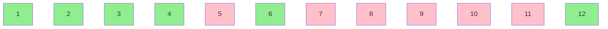
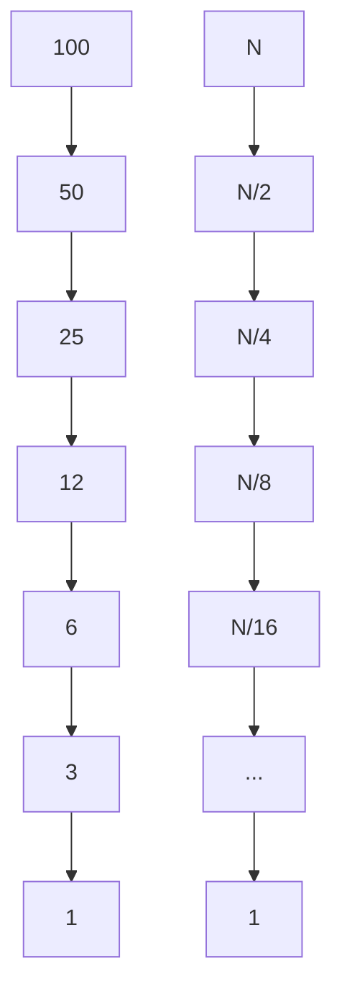

+++
title = "Basics"
linkTitle = "Basics"
math = true
date = "2025-06-15T05:58:51+05:30"
draft = false
weight = 1
+++

## Basic Prerequisites

### Sum of first N natural numbers
###### *1+2+3+...+N* = $\frac{N*(N+1)}{2}$
#### Derivation
S = 1+2+3+...+(N-2)+(N-1)+N\
**In reverse order**:\
S = N+(N-1)+(N-2)+...+3+2+1\
**On adding**:\
2*S = (1+N)+(2+N-1)+(3+N-2)+...+(N-2+3)+(N-1+2)+(N+1)\
=> 2*S = (N+1)+(N+1)+... N times\
=> **S = $\frac{N(N+1)}{2}$**

### Numbers in range [a, b]
###### = (b - a + 1)
**Observation**\
Range [3, 8] = {3, 4, 5, 6, 7, 8}\
=> 6 numbers\
Using formula, (8 - 3 + 1) = 6

### Number of factors of a number N
For N=12:
Iterate from $[1, 12]$ and check for factor of 12.

Total number of factors = {1, 2, 3, 4, 6, 12} = 6


Time for execution of a code. Depends on external factors.


#### Need for optimization
Let's assume CPU can perform $10^8$ iterations in 1 second.\
=> For $10^{18}$ iterations, it will take $\frac{10^{18}}{10^8}$seconds = $10^{10}$seconds $\approx$ **317 years**.\
This is an impractical amount of time.

#### Optimizations:
**Observation**\
if **i** is a factor of **N**, it means for some **j**,\
$i*j = N$ {both i and j are factors of N}\
$=> j = \frac{N}{i}$

Iterations are only needed till:\
$i \leq j$\
$=> i \leq \frac{N}{i}$

$=> i*i \leq N$\
$=> i \leq \sqrt{N}$

Iteration needs to be done for range $[1, \sqrt{N}]$.

Hence, time taken for $N = 10^18$ iterations:\
$\frac{\sqrt{10^{18}}}{10^8}$ seconds.\
$= 10 $seconds.
{}
Use $i*i \leq N$ rather than $i \leq \sqrt{N}$ because calculating $\sqrt{N}$ gives additional $log(N)$ time complexity. Remember to store i as long to avoid overflow condition.
{}

{}
In order to find if a number is prime or not, use the same function *countfractor(N) == 2* as condition, because prime numbers are numbers with just two factors (1 and the number itself).
{}

### Time Complexity
##### Program 1:
```java
int i = n;
while(i > 1) {
    i = i / 2;
}
```
Value of $i$ for N = 100.

Let number of iterations be $k$.\
$N = 2^k$
$=> log_2(N) = k$

##### Program 2:
```java
for(int i = 1; i<= N; i++) {
    for(int j = 1; j<=N; j++) {
        System.out.println(i+j);
    }
}
```
| i    | j [1, N] | No. of Iterations |
| -------- | ------- | ------- |
| 1 | [1, N] | N |
| 2 | [1, N] | N |
| 3 | [1, N] | N |
| ... | ... | ... |
| N | [1, N] | N |

Hence, total number of iterations = $N*N = N^2$

#### Program 3:
```java
for(int i = 0; i < n; i++) {
    for(int j = 0; j < i; j++) {
        System.out.println(i+j);
    }
}
```
| i    | j [0, i] | No. of Iterations |
| -------- | ------- | ------- |
| 0 | [0, 0] | 0 |
| 1 | [0, 1] | 1 |
| 2 | [0, 2] | 2 |
| 3 | [0, 3] | 3 |
| ... | ... | ... |
| (N-1) | [0, (N-1)] | (N-1) |

Total number of iterations = $1+2+3+...+(N-1)$ = $\frac{(N-1)*N}{2}$ = $\frac{N^2}{2} - \frac{N}{2}$
### Big O Complexity
#### Steps:
1. Find number of iterations.
2. Ignore lower order terms.
3. Ignore coefficients.

Eg: Big O Complexity of last problem is $O(N^2)$.

#### Why we ignore lower order terms?
Eg: No. of iterations = $N^2 + 10N$

| Input Size    | No. of iterations | % of lower order term |
| -------- | ------- | ------- |
| N = $10$ | $10^2 + 10*10 = 200$ | $\frac{10*10}{200}*100$% = $50$%|
| N = $100$ | $100^2 + 10*100 = 11000$ | $\frac{10*100}{11000}*100$% = $9.09$%|
| N = $1000$ | $1000^2 + 10*1000 = 1010000$ | $\frac{10*1000}{1010000}*100$% = $0.99$%|
| N = $10^4$ | $10^8 + 10*10^4$ | $\frac{10\*10^4}{10^8 + 10\*10^4}*100$ % = $0.099$%|

Therefore, as value of N increases, contribution of lower order terms reduces. For large N, the contribution is almost 0. That's why the lower order terms and coefficients are ignored when calculating Big O Notations.

### Bitwise Operations
| a   | b | a & b | a \| b | a ^ b |
| -------- | ------- | ------- | ------- | ------- |
| 0 | 0 | 0 | 0 | 0 |
| 0 | 1 | 0 | 1 | 1 |
| 1 | 0 | 0 | 1 | 1 |
| 1 | 1 | 0 | 1 | 0 |

| a | ! a|
| ------- | ------- |
| 0 | 1 |
| 1 | 0 |
