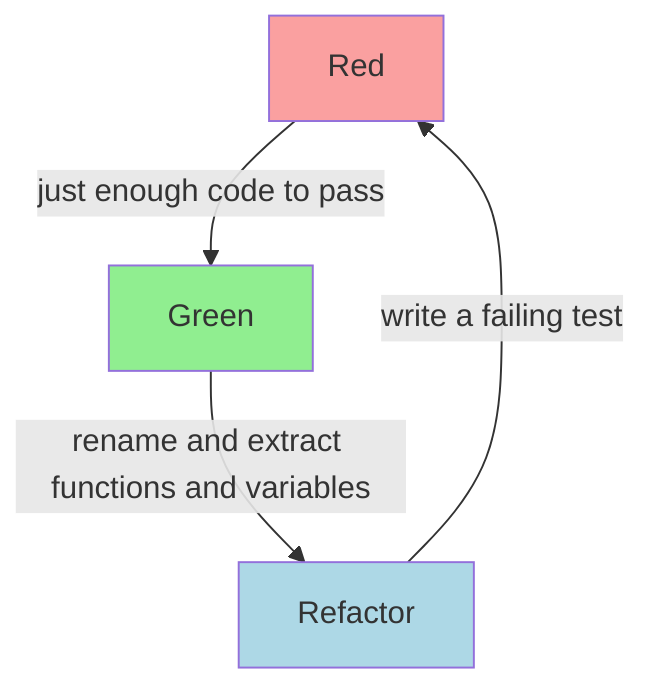

+++
linkTitle = "Clean Code"
title = "Clean Code by Uncle Bob (Robert C. Martin)"
draft = false
+++
Here is the link to original [Youtube Playlist](https://www.youtube.com/playlist?list=PLdpsE-GEhYVn_81kDPo1mwE73UgYCeMLu)

## Rules of Functions
1. They should be small enough so that no sub-function can be extracted from it.
2. Function should take atmost 3 arguments.
3. Don't pass boolean as function arguments for conditional processing.
4. Don't pass variables to store data.
5. Function should not create any side-effect (not change state of program).
6. Avoid switch statements.
7. Command-Query Seperation.

## Comments
1. Comment is a failure to express oneself through code.
2. Don't commit TODO comments in source control.
3. Don't commit commented cod in source control.

## Formatting
1. Average file size should be around 50 lines and max around 100 lines.
2. Line should not have length greater than 150 characters.
3. Variable Name Length ∝ Size of scope of variable
4. Function Name Length ∝ 1/(Size of scope of function)

{}
Pair programming is great way for knowledge sharing.
{}

## Professionalism
1. Never ship shit.
2. After every sprint (preferably 1 week), software must be ready for deployment (may not have features).
3. Stable Productivity: Feature release rate should not slow down with time.
4. Inexpensive Adaptability: Changeable Software.
5. Continuous Improvement.
6. Every engineer must practice Test Driven Development.

### Test Driven Development
1. Disciplined way of coding.

2. Evolve tests to become more specific.
3. Evolve code to become more generic.

{}
Lisp is a language that never dies.
{}
