+++
title = "Marketing Basics"
linkTitle = "Marketing"
math = true
date = "2023-11-21T05:58:51+05:30"
draft = false
weight = 1
+++




Satisfying consumer needs profitably.


Before starting a business, one must have a **Go To Market Strategy**. This strategy can be created through the following process:
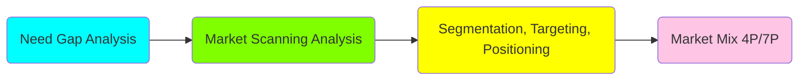

To form a better picture in mind, I'll create a mindmap:
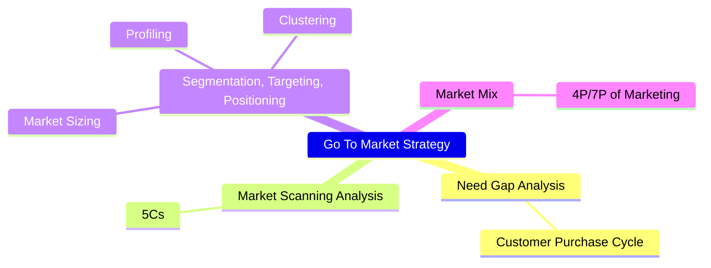

In this whole page, we'll learn this 4 step process to create a **Go To Market Strategy**.

## **Need Gap Analysis**
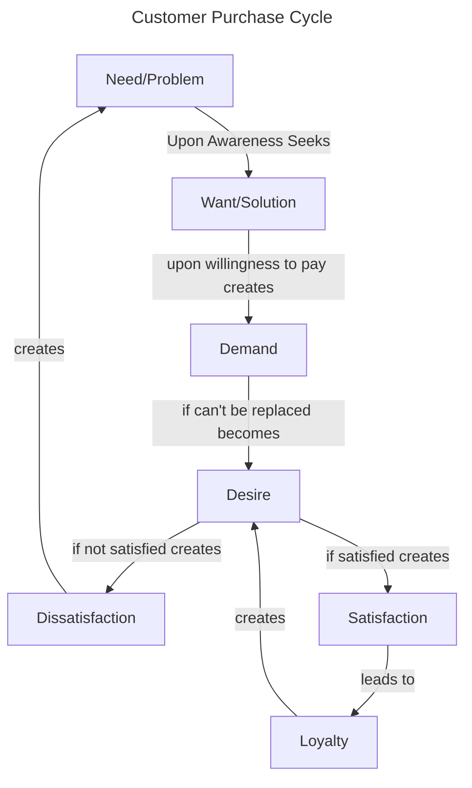

This whole process of customer up till desire, is governed by the **Value**. Marketer seeks to increase value either by increasing the benefits or decreasing the costs for the customer.

### Here are some definitions:


Need is a problem or dissatisfaction.



Want is a solution to a need/problem.



Demand is a want along with willingness to pay.

Demand = Want + Willingness to pay



Desire is a want that cannot be replaced.

Desire = Want + Can't be replaced



Satisfaction is when expectations meet perceived delivery.

Satisfaction = Expectations - Perceived Delivery

When expectations are greater than perceived delivery, it is called Dissatisfaction.



When customer want to buy a specific product only, not substitutes.



Customer buys the known brand. This is generally due to inertia of change, when customer is comfortable buying the known brand and doesn't looks at the substitutes.



When customer wants to buy a specific product because of the sense of belonging. The customer chooses a specific product at any cost, this generally happens when customer feels the brand has similar basic values as themselves.



Value is the sum of benefits for the customer minus all the costs he/she has to pay.

Value = ∑Benefits - ∑Costs



### Roles of Marketer
By analyzing this framework, we can easily understand the roles of Marketer.

1. Create Awareness of a Problem/Need.
2. Create solution.
3. Create demand.
4. Convert demand to desire.
5. Match expectations.

I'll be updating this blog as I learn new things.

### Need Gap Analysis
This simple framework can also be used to find out any gaps in markets, if any. The five types of possible gaps are:
1. Lack of *Awareness* of a problem/need
2. Lack of a *Solution* to a known problem/need
3. No good *Value Proposition* for a good solution
4. Possibility of *Value Enhancement*
5. Customer *Expectations* are not being matched 

{}
A business can be started if there is any one or more of these gaps. A business can't sustain if it doesn't fills all the gap.
{}


## **Market Scanning Analysis**
This is also called Stakeholder Analysis or 5C Analysis. This is basic analysis that any business should do before starting.

Before starting a business, one must check if the business is:
1. Profitable (Competition)
2. Understandable (Customer/Consumer)
3. Feasible (Context)
4. Capable (Company)

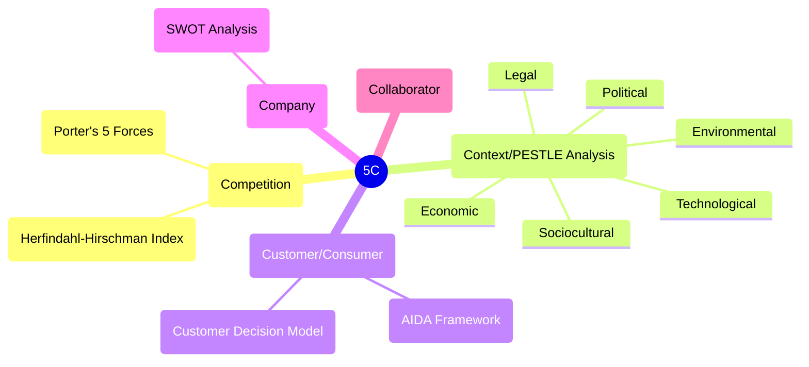

### Competition/Profitability Analysis
One Model of analyzing competition/profitability is called *Porter's 5 Forces*. The five forces are:
1. Bargain Power of Supplier
2. Bargain Power of Buyers
3. Threat of Substitution
4. Threat of New Entrance
5. Extent of Rivalry

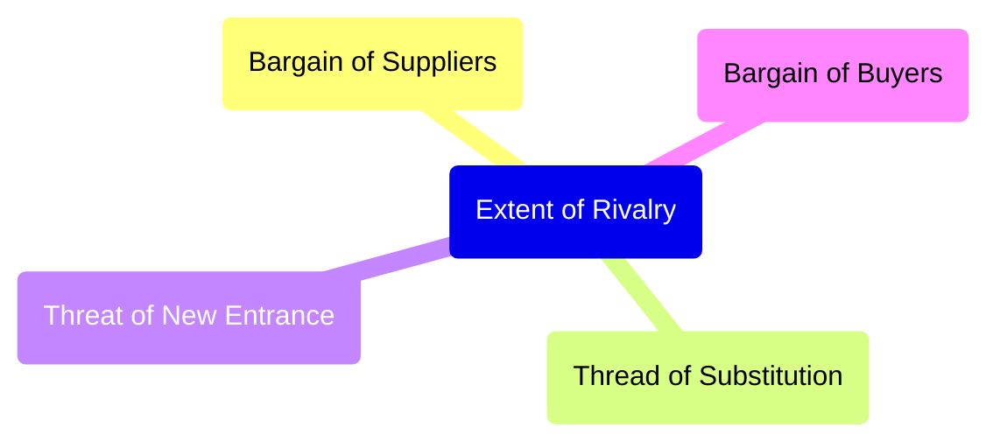

#### Bargain Power of Buyers
If there are multiple brands with similar value propositions, and very few buyers, ie. supply is greater than demand, the buyers have better power to bargain and ask for better prices. They ask brands to lower prices or they may buy from other brands.

Extreme case is when there is only one buyer and multiple suppliers, this market is called Monopsony. One example is market of satellites and missiles. The Government is the only buyer, but there are multiple suppliers.

#### Bargain Power of Suppliers
If the raw material a brand uses has very few suppliers, suppliers can have greater bargain power to increase their costs. They may ask higher prices for the raw materials or they may sell it to other company.

Extreme case is when there is only one supplier and multiple buyer, this market is called Monopoly. One example is radio frequency bands which can only be bought from governments.

#### Threat of Substitution
If a new product is launched in the market with better value proposition, the brand may have to reduce their prices to increase their value of product and match it with the new product. (Value = ΣBenefits - ΣCosts)

#### Threat of New Entrance
If new product enters the market, it will start replacing the existing products. To increase the customers, the other brands will try to increase their products value by decreasing prices (assuming it cannot add other benefits). This will make the market less profitable.

#### Extent of Rivalry
Rivalry of market depends of two factors, the number of products and the distribution of market shares. If there are more number of products, it means the market is more competitive. If the market share is evenly distributes amongst all products, means the market is more competitive.

##### Herfindahl-Hirschman Index (HII)
HHI is used to measure the extent of rivalry in a market.

In simple words, HHI is the sum of square of market share of all the products in the market.

 The formula of HHI:
$$
 HHI = \sum_{i}(MS_{i})^{2}
$$
$MS$ is Market share of a product.

$ 0 \leq HHI \leq  1 \\ $ if Market Share is in fraction.

$ 0 \leq HHI \leq  10000 \\ $ if Market Share is in percentage.




{}
As a general rule of thumb in industry, **HHI > 0.3** is called a less competitive market and hence more profitable, whereas a market with **HHI < 0.3** is said to be more competitive and less profitable.
{}

### Customer/Consumer
After understanding how to analyze Competition and Profitability, we'll learn how to understand customer/consumer.

{}
**Customers** are the people who buy the product whereas **Consumers** are the people who finally use the product. Example: for baby diapers, baby's parents is the customer (make purchase decision) and the baby is the consumer (actually uses it). Many times customer and consumers are same.
{}

#### AIDA Framework
AIDA Framework is used to understand how consumers make decisions. It stands for:
A -> Awareness about the need/problem
I -> Interest to look for options/alternatives
D -> Desire to choose/consider
A -> Action to buy/not buy

##### Awareness
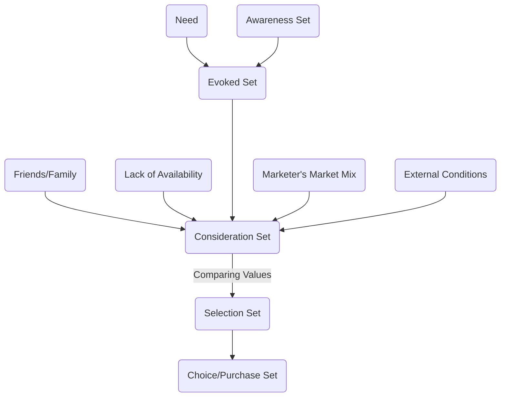

Here are some definitions related to consumer awareness:


Products/brands a consumer is aware about. Any product/brand a consumer has ever heard about will be considered in the Awareness set.



Top-of-the mind brands/products. The brands/products with quick recall for a customer are called Evoked Set for him/her.



Products that a customer considers to buy are called consideration set. The consideration set is often influenced by Friends and Families.



After analyzing Consideration set, the customer narrows it down to Selection Set, which is a handful of products he can buy depending upon the prices and his/her specific needs.



Final products that the customer chooses is called Choice Set/Purchase Set.


In Low Involvement Process, the customer moves from Awareness Set to Selection Set and to Purchase Set. In other words, customer picks up any know product that solves his/her problem without doing much analysis. In High Involvement Situations, the customer passes through all the steps. 

#### Consumer Decision Model (CDM)
Later AIDA model was replaced by *Consumer Decision Model*. CDM takes into account one more step other than AIDA model. Consumer Decision Model considers these five aspects of customer decision:
1. Need/Problem recognition (Awareness)
2. Search for alternatives/options (Intent)
3. Evaluation of alternatives (Desire)
4. Purchase/Consumption (Action) 
5. Post purchase evaluation


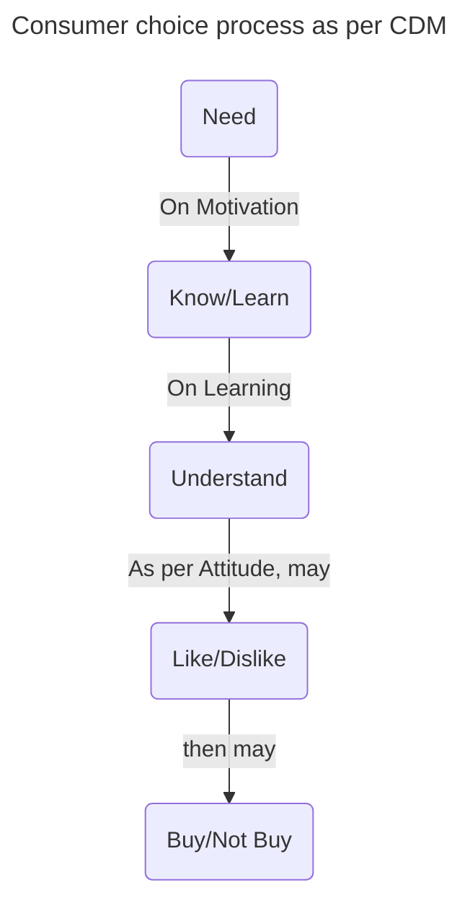

{}
The whole consumer choice process is governed by two factors: **Culture** and **Personality**.
{}

#### Attitude
Attitudes are formed opinions. Attitude has a direction (negative or positive) and magnitude (intensity). In simple words it is what we like or not like.

Attitude starts with Consumption (a person would like to consume a product or not), then it may carry forward towards Product/Product Category (a person likes the product or not), then it carries forward to brand (the customer likes the brand or not).

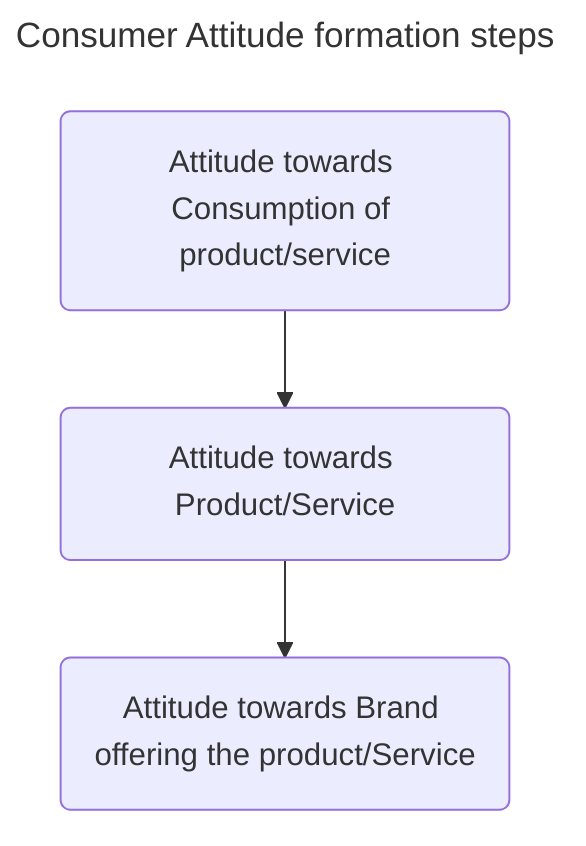

{}
Increasing attitude toward consumption is called **Market Creation Process**. Eg: Ola, Uber created attitude towards convenient taxi.
{}

##### Why we form Attitude?
There are three reasons we form attitude:
1. Value Expression
2. Ego Defensive
3. Utilitarian

{}
You can never be a good marketer with a bad product.
{}

If you know the product is best, make sure the customer goes through all the decision making process.

### Context/Feasibility
Context looks at the Macro Environmental Factors which affects the business. This is also called PESTLE Analysis:
1. Political
2. Economic
3. Sociocultural 
4. Technological
5. Legal
6. Environmental (Sustainability)

An example of a business satisfying both other Cs but cannot succeed because of the context is BigMac. BigMac is a beef burger very successful in western countries. But it is not a success in India because of the sociocultural factors. In India, most population treats cows as holy animal and would not eat beef burger. the business is *Profitable* (no competition) and *Understandable* (customers have loved the taste worldwide).

An example of Technological context is the advent of AI.

### Company/Capability
Before going into market, the company must know its strengths and the opportunities those strengths will give it, and also the weaknesses and the possible threats those weaknesses can pose to the business. This analysis is called SWOT Analysis (Strengths, Weakness, Opportunities and Threats). SWOT Analysis is by mapping companies strengths to the opportunities those strengths can open up, and mapping weaknesses to the threats those weaknesses can pose to the business.



## **Segmentation, Targeting, Positioning**


Segmentation is the process of dividing customers from heterogenous groups (with different needs) to homogenous groups (similar needs).


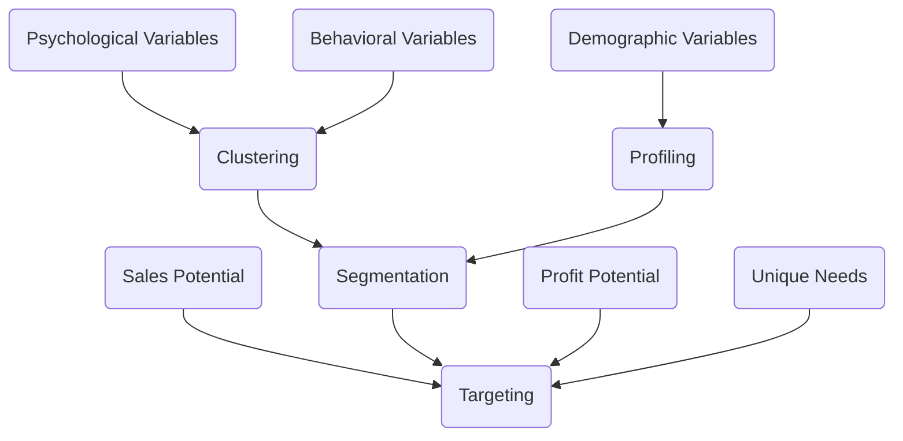


Describing and naming clustered groups.


An inefficient way to segment customers is through demographic variables (age, geography, location, income, religion). This is commonly used because this data is easier to get and more objective. But the accuracy of the formed segments through this process is often low because people with similar demographics may not have similar needs/problems.

The better way to segment customers is through behavioral and psychological variables. People with similar behavioral patterns and interests are more likely facing similar problems.


Personality + Values + Lifestyle/Behaviors


#### Personality
Personalities can be of 3 types:
1. Compliant: Their character traits are:
   - Desire to belong
   - Following rules
   - Need for love and belonging
2. Aggressive: Their character traits are:
   - Need for achievement
   - Success and esteem
   - Need for power
3. Detached: Their character traits are:
   - Break the rules
   - Need for self-actualization
   - Do things because they like to do it
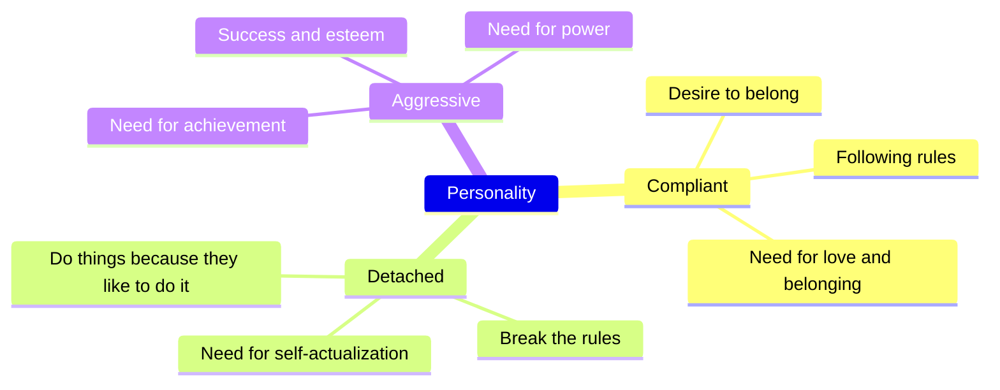

Here is an example of commercial targeting [Aggressive Personality Type](https://www.youtube.com/watch?v=8PHzPmyUeS8).

Here is an example of commercial targeting [Complaint Personality type](https://www.youtube.com/watch?v=_y0y_XeS0fM).

Here is an example of commercial targeting [Detached Personality type](https://www.youtube.com/watch?v=btFwYkWkkhs).


#### Values
Values are formed through upbringing. Values are the beliefs that people have about the world. A few examples of values are:
1. Miserliness
2. Spendthriftiness
3. Altruism
4. Minimalism

#### Lifestyle/Behavior
Behaviors are the habits that people have. There are more than 1000 documented behaviors. Hence there are many behavioral variables.

### Clustering
Usually for segmentation, a questionnaire (with multiple choice questions, with choices being levels) is circulated in the market with questions related to customer behavior and psychological variables. The responses are then clustered based on the similarity of the responses.

Each question will be considered as a variable and levels plotted on a graph. Each point represents a customer. The similarity between the responses is calculated by the distance between the points on the graph.

The distance between two points on the graph is calculated as the sum of the squared distances between the points.


Let there be a questionnaire with *n* questions and two customers A and B with responses a₁, a₂, a₃, ..., aₙ and b₁, b₂, b₃,..., bₙ, then distance between them is:
$$ D_{AB} = \sqrt{\sum_{i=1}^{n}(a_{i} - b_{i})^{2}} $$


The clustering is usually performed by a software. We specify the number of clusters we need, and the software computes the clusters.


The algorithm is based on the Euclidean distance formula. The algorithm performs many iterations. In each iteration, the algorithm calculates the distance between all the combinations of two points and clubs the closest points together. After clubbing the points, the algorithm repeats the process until the number of clusters is reached.




After the software has formed the clusters, we'll use the clusters demographic data to label the clusters, so that it is easier to convey the information to people from other departments, like sales department. The process of labeling and naming the clusters is called profiling. Different profiles may have some demographics overlap.

{}
The AIO (Activity, Interests, Opinions) Model is a helpful tool to analyze customer behavior.
{}

On the basis of segments, customer persona is formed.

Systematic Segmentation is performed in three steps:
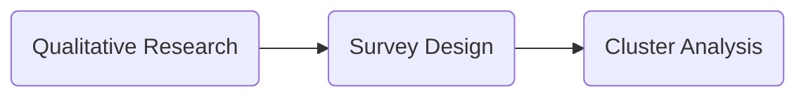

### Targeting
Targeting is the process of selecting the best group/s among the formed segments. Targeting is done on the basis of these three factors:
1. Sales Potential
2. Profit Potential
3. Unique Needs

#### Sales Potential
Sales potential is generally estimates through **Market Sizing** process. Market Sizing is done by estimating TAM, SAM and SOM.


Total Addressable Market is the total number of population that would be willing to buy the similar product/service globally.



Serviceable Available Market is the subset of TAM which the company can reach to. This can be restricted by geography and resources.



Serviceable Obtainable Market is the subset of SAM which company can acquire in a given amount of time. This is restricted by the competition and the percentage of market share the company can acquire.


Example, if one wishes to setup a lemonade shop at locality, 
- **TAM** is the total population that would like to drink lemonade.
- **SAM** will be the areas where the lemonade shop is located, (few kms. around it).
- **SOM** will be the the customers that will most likely come to the shop.



The market sizing estimation can be performed in two ways:
###### Top-Down Approach
1. Start with large population population (TAM) and boil down to smaller population (SOM).
2. If there is a demand constraint of the product, this approach should be preferred. If company can sell to everyone who ask for the product, then Top-Down Approach should be used.
3. Generally approach is used to get monetary estimates.

###### Bottom-Up Approach
1. Start with small-scale dynamics and scale it up to larger population. Example for a retail chain, one can estimate sales in one shop and then scale it up to the entire country. A shopkeeper may start with one week's sales and estimate the sales of the whole year.
2. If there is a supply constraint, this approach should be preferred. Examples are expensive products or products limited by resources.
3. Generally this approach is used to get units estimates.

{}
As already discussed, profit potential is estimates by analyzing competition and HHI. Unique needs need to be identified by segments of segmentation.
{}


### Positioning
After identifying target group/s, the company needs to position itself in the market.

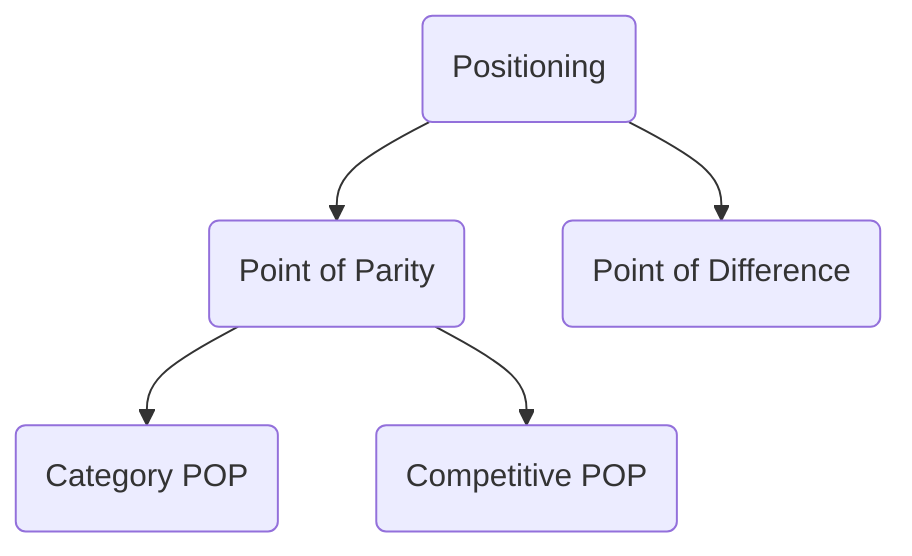


Positioning is the process of occupying maximum mind-space of customers.



Point of parity is the characteristics which are similar to competitors so that customers can trust the new product. Eg. for a new ketchup to gain customer trust, it must look like ketchup (red color, bottled etc).



Point of Difference is the differentiators that the new product/service has which can be advertised to customers. Eg. Maggi tomato ketchup campaign emphasized the sweet and spicy taste as differentiator from other ketchups. 



Category Point of Parity is characteristics similar to all other products in the same category, which allow the new product/service to gain trust. Eg. for a new ketchup, the product must be similar to other ketchups.



Competitive Point of Parity is characteristics similar to leading competitors, which allow the new product/service to gain trust. Eg. new mobile phones can advertise themselves having similar processors than top phones.


{}
A good book on positioning is *"Positioning - The Battle for Your Mind, by Al Ries and Jack Trout"*.
{}

## **Marketing Mix**
### 4Ps of Marketing
<!-- ```mermaid
mindmap
    4Ps
        Product
        Place
        Price
        Promotion
``` -->
A solution consists of four components:
1. Product/Service
2. Price
3. Place
4. Promotion

{}
The 4Ps model was introduced by Jerome McCarthy in 1960.
{}

#### Product

Product is a bundle of features that provide benefits.



Product + Service


##### Layers of Goods




Bare minimum features that are required to solve the need.



Bare minimum features that consumers seek in order to accept the product as a solution.



Additional features that separate a product from it's competitors.



The unknown features that can be added to the product to improve it in future.


Let's take example of a hotel industry. If you are in a jungle with no options to sleep, any closed room-like thing would solve your need to sleep. You would sleep in any cave or barren room on the floor. So, just a room where you can be safe from predators and others for some time is a basic product for the problem. This is called **Core Benefit**.

If you are in city, you'll compare other hotels and expect a good bed, clean bedsheets and clean bathrooms as the bare minimum features to stay in the hotel. This is called **Expected Product**. This can also be called *Point of Parity*.

If among all hotels, only one hotel provides you a television also, that will be called **Augmented Product**. This can also be called *Point of Difference*. Process of adding additional features in order to stand-out is called *Augmentation*.

Whenever there is augmentation in any market, competition mimics the augmentation and and tries to convert augmented product as the expected product.

Another example of soap industry: In 1990s, soap was sold by cutting small pieces from a large bar and sold by weights. Then some soaps augmented the product by selling them in standard packaged bars, gradually the augmented soap became the expected soap.

{}
**Branding** is one augmentation that competition cannot mimic.
{}


A theoretical condition where no more augmentations are possible in a product. In practice, every product can be augmented.


**Potential Product** is an abstract idea which describes the future upgrades in the product.

##### Types of Goods
Goods can be of three types:
1. **Search Goods**: Goods that can be evaluated before consumption. Eg. pen, and all the physical products
2. **Experience Goods**: Goods that can be evaluated after consumption. Eg. movie, trip
3. **Credence Goods**: Goods that cannot be evaluated even after consumption. The Credence Goods cannot be evaluated either because of lack of expertise or lack of benchmark. Eg. educational courses, doctor's consultation.

##### Product vs Service
Services are high on these four parameters:
1. Intangibility (Cannot be measured)
2. Variability (Changes over time/place)
3. Simultaneity (Production and consumption happens simultaneously, can be given to multiple consumers simultaneously)
4. Perishability (Cannot be reused/stored)

###### Intangibility
Services are high on intangibility (cannot be measured). So to stand-out, companies use **Physical Evidences** so that consumers can compare the services. Example: knowledge gained from a course cannot be directly measured to institutions show placement statistics and exam score.

{}
Products are high on tangibility, but to differentiate the product from competitors, intangible elements are added (eg. brand equity).
{}


A promise or trust that a particular product makes.


###### Variability
Since services are provided by people, they are subject to variability. Example a class given by a teacher A would be different from teacher B. Even the classes given by teacher A would be different at different times.

To minimize variability, companies put up *processes*.


Standard operating procedure.


###### Simultaneity
Services are simultaneously produced and consumed at the same time. Eg. a barber can only cut hair when the consumer is sitting on the barber chair.

Also, services may be provided to multiple consumers simultaneously. The service provider must be trained enough to satisfy multiple consumers simultaneously.

###### Perishability
Products can be stored and used for future needs. Services cannot be stored and used for future needs.

Eg. a flight ticket cannot be stored and used for future needs, once the flight takes off, empty seats are wasted. To control these wastage, flight companies use dynamic price strategy. They keep prices very low for people booking several months before the flight. This ensures some seats are filled. Then they increase the price as the flight date comes closer, but if the seats aren't being filled, they again reduce the prices. Also, just one day before the price, they increase the prices a lot because people generally book the flights one-day before in case of emergencies.

Similarly, tourism industry also varies prices of hotels based on the season. Food is perishable, hence when it becomes at the verge of perishing, the prices are lowered.

#### Product Planning

Ensure sustainability of the organization/company.


To launch new products, companies have to plan the product.

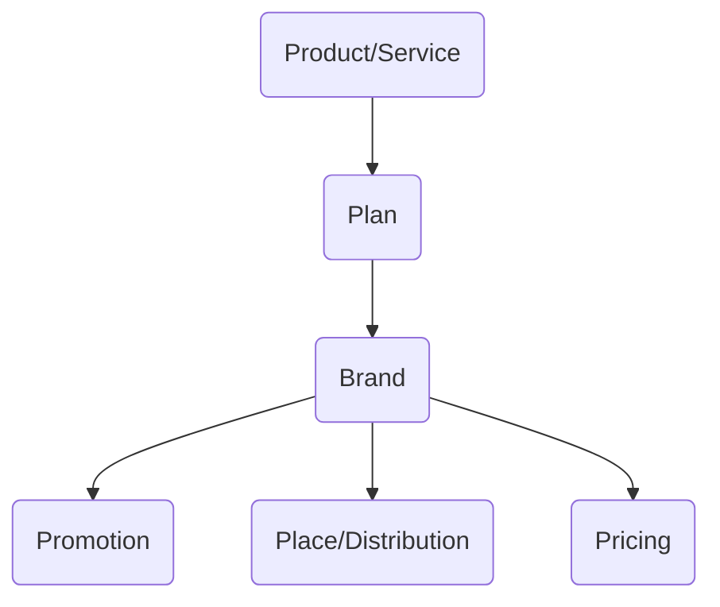

##### Ansoff Matrix




Increasing the consumption of existing products to existing consumers.



Taking the existing products to new markets. It can be either to different geography or to different segment (customers with different needs).



Creating new products for existing customers (segments).



Creating new products for new segments. It can be either related (similar manufacturing process) or unrelated (different manufacturing).


We'll take example of coca-cola. If it wants to penetrate market, it can create new packages like Pet Bottles, or Christmas Special or some limited edition bottles. If it wants to develop new markets, it can try to expand same coca-cola to Arab countries. If it wants to create new products, it can create diet coke. If it wants to diversify, it can create new products like T-Shirts (Unrelated) or Vitamin Water (Related).

##### Extensions
Apart from Ansoff Matrix, product planning can also be understood through extensions:
1. **Variant Extension**: Minor variants (Diet Coke)
2. **Line Extension**: Major variants (Vitamin Water)
3. **Brand Extension**: Entirely Different (T-Shirts)

##### BCG Matrix
One more model to plan products is BCG Matrix. It is a useless model which classifies the products based on their *Market Growth* and *Relative Market Share*, both of which are not possible to measure objectively. Weird names are provided to the four types of products: *Stars*, *Question Mark*, *Cash Cows* and *Dogs*.



1. **Stars**: Products with high growth rate and high relative market share. It is advised that the company should invest more in marketing of such products.
2. **Question Marks**: High growth rate and low market share. If the company has surplus capital, the company may take risk in investing in marketing of such products. It is a risky investment, but if the market share increases, it will convert into a *star* product.
3. **Cash Cows**: High market share and low growth rate. It is advised not to invest more in such businesses, just enough to sustain it and use the profits to fund stars and question marks.
4. **Dogs**: Low market share and low growth rate. Even though dogs are good creatures, the dog products are assumed useless and should never be invested in.

The fundamental assumption that the growth rate of an industry and relative market share of a product can be measured objectively is incorrect. Therefore personal biases come into play when classifying the products, hence this product is useless. I added this just because it was taught in class.

##### Product Lifecycle
Another useless model which classifies the product based on some imaginary stages: *Introduction*, *Growth*, *Maturity* and *Decline*. It plots graph between time and sales.



The only problem with this model is that it is too generalized and oversimplified. Many products don't live long enough to see the growth stage and you cannot predict the decline of any product as long as it is in the market. Innovations and situations can change destiny of any product.

#### Place/Distribution

Process by which products are transferred from Manufacturer to consumer, and feedback and money are transferred from customer to manufacturer.


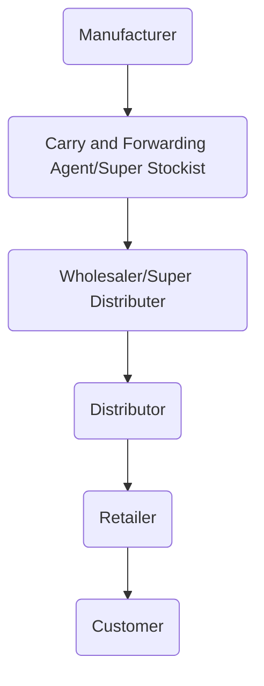

Earlier, when manufacturers were limited, they were the most powerful in this distribution process. Now, with increase in competition, retailers have become the most powerful since they have the information of the customers.

{}
Carry and Forwarding Agent is a company which is responsible for carrying the product from manufacturer to wholesaler. This is owned by company but located in different states. This was a technique to reduce tax because VAT was different in different states. After introduction of GST, the CFA is no longer needed.
{}


Introducing a new entity in supply chain.



Removing the intermediary entity from supply chain.



Changing the intermediary entity from supply chain.


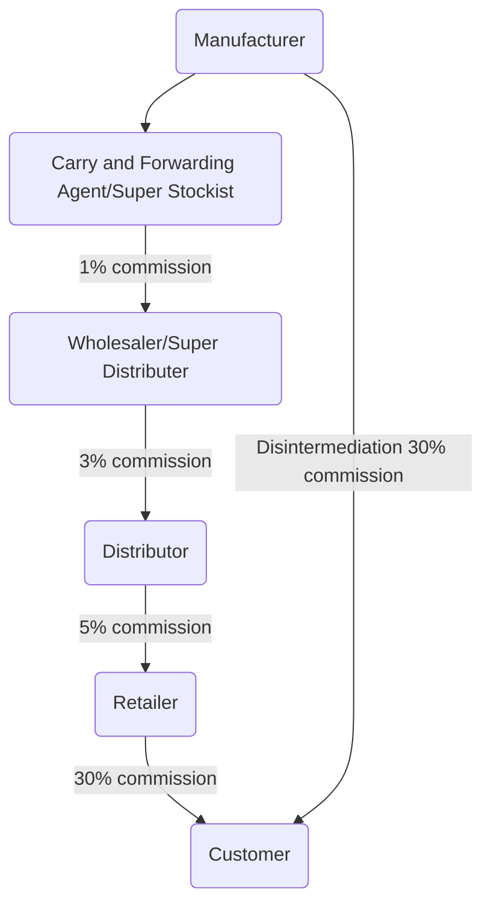

Direct to customer (D2C) is a method developed after the popularity of online markets. The manufacturers can now take direct orders from end customers without a need to have a local retail shop. The distribution happens in almost same way as before. Therefore, D2C is more of a branding game rather than a distribution game.

{}
Most of new online businesses are just make use of intermediation processes. Eg. Swiggy is an intermediatory between food producers and food consumers, uber added as an intermediatory entity between cab drivers and customers. MakeMyTrip is a new intermediatory entity between travelers and hotels. Amazon is a distribution based business.
{}



##### Optimal Distribution Strategy (Theory by Bhupesh Sir and his guide)



Products for which information is also needs to be provided along with the product. Any new technology can be regarded as an High Information Product. This depends more on how customer perceives the product.



Products which are highly customized for individual customer is called high customization product. Eg. Dominos, Starbucks.


Concentrated and fragmented market is considered on geographic basis and the number of customers in total.

###### Direct Distribution / Vertical Marketing
If the product is highly customized or highly informational, and very few customers are there to deliver to, then it is recommended that company should directly fulfil needs of the customers. Eg. aircraft

###### Franchise
If the product is highly customized or highly informational, but the customers are scattered all across geography, then it is recommended that company should franchise the product to the customers. Eg. Kaventers, Tata Motors. This makes it easier to train franchisees so the customers can get customized products and proper training for their products.

###### Hybrid Model
If the product is low in customizations and less information is needed for customer to use it, and customers are located in smaller geography or customers are less in number, it is recommended that company should make deals directly with the customers and a third party should fulfill the needs of the customers. 

###### Intensive 3rd Party Distribution
If the product is low on customization and less information is needed, and customers are scattered in the geography, then it is recommended to be distributed via classical third party distribution. Eg. soap, pen etc.

The distribution systems often change over time. Eg. MacBooks were earlier sold only via franchise, but now they are available at 3rd party distribution platforms like amazon.

##### Intra-Brand Competition
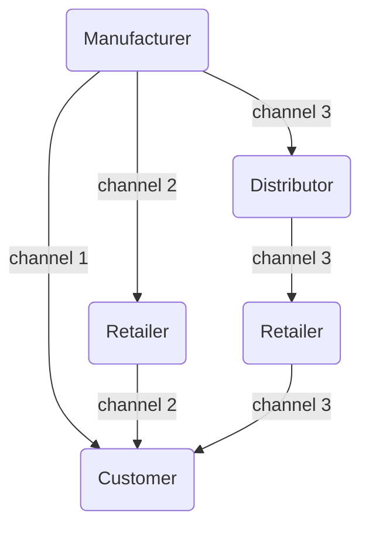

Same product can reach the customer via different channels and the price for customers will be different. This is called *Intra-Brand Competition* or *Intra-Channel Competition* or *Channel Conflict*. This may lead to reduction in price of the product.


Checking product and price online, and buying offline.



Checking product and price offline, and buying online.


There are two methods to avoid it:
###### Short-Term Method
Make certain SKUs exclusive for a certain channel. Eg. Samsung may restrict newer models exclusive for its own outlets and older models can be sold via the classic 3rd party distribution.

###### Long-Term Method (Omni Channel Experience)
This is a philosophy that emphasizes seamless experience on all the touchpoints. That means, customer may be able to check the product in any channel and buy it in any channel. This is practically difficult because then the incentive systems needs to change. Currently, sales incentives are based upon sales made through specific channel, but this system would not be fair in an omni-channel experience.


Any interaction of customer with product/brand is called a touchpoint.


##### Inter-Brand Competition
To deal with inter-brand competition between two supermarkets, brands use the following two techniques:
1. **EDLP**: Every Day Low Price means keeping the prices very for all the products. This improves customer loyalty and increases volume of sales, if advertised properly.
2. **Loss Leader**: Selling a product, in limited quantity, at loss is another strategy to increase footfall in supermarket. Usually the loss leader is kept at the end of the store so that customers look at all the other products in store and perhaps make purchases. Eg. first kg of sugar may be sold at loss and kept at the corner of store.

**Anchor Store**: Malls often have a popular store which attracts customers into the Malls. This is called anchor store strategy.

#### Promotion

##### **Dolan's 6M Framework**
A good paper to have better reference is  paper.

The framework is quite exhaustive. It consists of following steps:
1. **Mission**: What is my objective?
2. **Market**: Who is my customer?
3. **Message**: What I want to convey?
4. **Medium**: How can I reach them?
5. **Money**: How much resources I need?
6. **Measurement**: How effective was the promotion?

If these questions are answered accurately and in sequence, probability of running a successful campaign is very high.

Promotion can serve two purposes: Create Awareness and Induce Purchase (Sale).
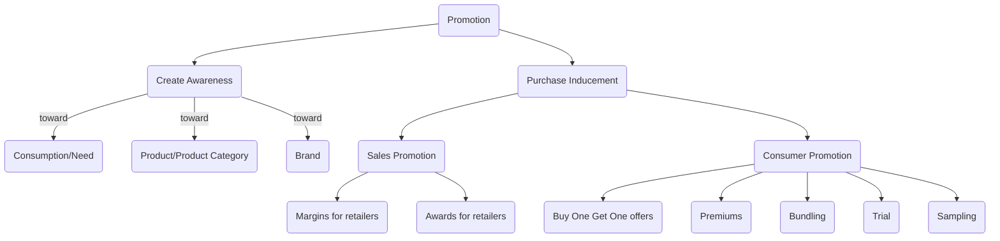

##### Creating Awareness
###### Advertisement
There are many types of advertisements, some common types of advertisements are:
1. **Regular Advertisement**: Explains the brand
2. **Ambush Advertisement**: Use competitor's advertisements to promote your own product. Eg: [Volvo Super Bowl Campaign](https://www.youtube.com/watch?v=CVhE6WFnySs), when Coca Cola was official partner of ICC, [Pepsi's Nothing Official About It Campaign](https://youtube.com/watch?v=riwOAtmMhZY)
3. **Guerilla Advertisement**: It takes customers by surprise. Eg. [Tea for Trump Advertisement](https://www.youtube.com/watch?v=hYy7qy2AQeo)
4. **Surrogate Advertisement**: Use a surrogate to advertise. Very common with products that are illegal to advertise. Eg. [Men Will Be Men Campaign for Imperial Blue](https://www.youtube.com/watch?v=kJofDnUYPhw) whiskey brand was advertised through CD.
5. **Social Advertisement**: Focuses on social cause and the brand/product is becomes the backdrop of the advertisement. Eg. [Lifebouy help a child reach 5 campaign](https://www.youtube.com/watch?v=UF7oU_YSbBQ)
6. **User Generated**: When the user promotes the brand/product. Eg. when maggi was accused of harmful ingredients, it started tell your maggi story campaign where customers shared their experiences with maggi.
7. **Subliminal Advertisement**: Subconscious cues that trigger brand recall. Eg: [Anar Foundation "Only For Child"](https://www.youtube.com/watch?v=6zoCDyQSH0o), many company logos have subliminal messages, [watch this video for details](https://www.youtube.com/watch?v=CHkkdDRqJOI).
8. **Captive Advertisement**: Advertising when customer is in captive state, i.e. it has nothing else to do. Eg. World Cup Urinal Goal, was added in male urinals to spread awareness of not spilling urine while urinating (in a captive situation). Also, many companies advertise in flights and trains because the people are in captive state then, and are bound to pay attention to such advertisements.
9. **Fear Based Advertisement**: Eg. Smoking kills campaign to spread awareness around cigarets. Many health and diet companies use this technique to promote their products.
10. **Comparative Advertisement**: Directly comparing other brand. Eg. [Apple and Blackberry Series of Advertisements](https://www.youtube.com/watch?v=zMFuPbUQBPQ), [Smart Car Race Advertisement](https://www.youtube.com/watch?v=b1iJJZfB7i0). It is illegal in India to take name of another brand in any advertisement.

These advertisement types are not exclusive, these are just ideas to provide direction of thinking.

Apart from advertising, there are other methods to promote awareness like:
- Direct Email
- Exhibitions and Tradefairs (for B2B)
- Telemarketing

##### Purchase Inducement
**Sales Promotion**: For sales promotion, one must incentivize the customer, i.e. retailer. This is generally done through increasing margins (external) or giving schemes/tours/offers (internal) to the retailer.

**Consumer Promotion**: This process involves providing incentives to end consumers, like:
1. *BOGO*: Buy One Get One offer
2. *Premiums*: Providing something free/extra with the product.
3. *Bundling*: Bundling means providing some different products together as a bundle. Bundling provides convenience and const-effectiveness to the consumers. It can be of two types:
   1. Mixed bundling bundles things that can be purchased and used separately as well. Eg. cold drink and burger
   2. Pure bundling bundles things that cannot be used separately. Eg. All-Out and refill.
4. *Trial* and *Sampling*: Providing the product for a limited period of time or some amount for free for consumers to evaluate.

|     Publicity    | Public Relations |
|:---------:|:---------:|
|Organically Generated|Company Induced|
|Can be both +ve or -ve|Always positive|

{}
Publicity may be seeded by company through **Seeding Strategy**.
{}

#### Price
Pricing is the most unique *P* among all the 7*P*s because it is the only *P* that brings money in the company, all other *P*s take money out of the company. 
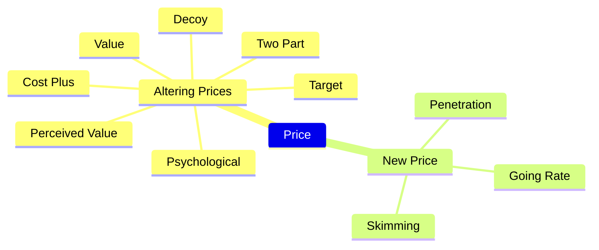
##### Cost Plus Pricing
The easiest and most straightforward way to price things, but one of the most ineffective way of pricing. The simple formula used for this is: $$ Price = \dfrac{FixedCost}{N}  + VariableCost + Margin $$ Where $FixedCost$ is the initial setup cost, $N$ is the total number of product sold in lifetime, $VariableCost$ is the additional cost per unit, and $Margin$ is the additional margin the company wants to gain.

Example, if cost of setting up a pen factory is ₹50000 and it is estimated that it can product 10000 pens in lifetime, additional material cost for each pen is ₹4, and the manufacturer wants ₹2 profit on each pen, then according to equation, the price will be ₹ $50000/10000 + 4 + 2$ => $₹11$.

The problem with this method is that it is based on guess work, i.e. we don't know what $N$ will be. If we over-estimate the $N$, it is easy to take up losses. Also, this method may give very low prices, which may incur *Notional Loss* to the company.


When a company has potential to make more profits but is doesn't do so, it is called notional loss.


##### Target Costing
This method was developed by japanese. It is also called Conjoint Analysis or Part-Worth Analysis. It is based on asking customers questions and willingness to pay. It is a complex mathematical process. Through the analysis, a price is estimated. After that, feasibility of the business is estimated using the *Cost Plus Pricing* formula. The $N$ is estimated using market sizing (how many customers will purchase the product). Then for business to be feasible, margins must be positive. This condition is checked before starting any business.

##### Perceived Value
So far, it is not actually a strategy, but philosophy. More intellect has to go into it to convert it into a mathematical/logical strategy. It says one should focus on the customer's need and perceived value of the solution/product.

Eg. if there are two wood cutting tools, A Cutting Tool and B Cutting Tool. A requires to be replaced after 30hrs and costs ＄1, whereas B requires to be replaced after 120hrs and costs ＄5. If B is not getting sales, the most obvious solution for B will be to reduce price. But it should actually change the perception of the customers around its product. It takes 20 minutes to change the tool for the labour. To work for 120hrs, the tool A requires 1hr extra just to change tool. Average cost of labour in US in ＄15 per hour. Hence the actual cost is 4 + 15 = ＄19. Hence even if the cutting tool raises it's price to $16, it still is providing greater value that A.




Another example is a person in US buying a fridge. Comparing two brands MayTag and LG. MayTag costs ＄2000 and lasts for 25 years whereas LG costs for ＄800 and lasts for 10 years. If someone came to US just to do service for 5 years, he/she may prefer LG, but if someone has settled in US, he/she may prefer MayTag. One may also consider the resale value of the fridge after 5 years.

##### Value Pricing
To increase the value, companies reduce the price.
Value = ∑Benefits - ∑Costs

Most common example is of EDLP (Every Day Low Price).

##### Psychological Pricing
Minor tweaks in prices that have major perception difference. Eg. pricing things at 99 appear much cheaper than priced at 100. Dove also used this to appear premium by pricing it's sachet at Rs. 7. Pricing things at 45 and 55 also work in similar way. This technique is called last digit manipulation.

Subtraction principle means showing high price and slashing it off and display selling price as very low. This is also a psychological tactic to change perception that the product is very cheap.

##### Decoy Pricing
Introducing intermediate option to subtly push customers into buying the expensive option.

Eg. The Economist Magazine had introduced three prices: `$59` for digital version, `$126` for only print version and `$126` for both digital and print version. The only print version was a decoy to convince people that the both print and digital version is more valuable.

Eg. popcorns in theatres often have three versions, small `$3.5`, medium `$6.5` and large `$7.0`. Because of introduction of the medium variation just slightly less price than large, the large variation appears to provide more valuable, hence customers tend to purchase more of the large variation.

##### Two Part Pricing
When a product requires two parts to be used, one fixed part and other variable part, generally price of fixed part is kept low and the variable part is more expensive. Few examples are razor and blade, printer and toner.

##### Skimming
When introducing a high information, the product is often introduced at high price, then prices are reduced over time. This allows the company to cater to the customers with high willingness to pay and also low willingness to pay.

##### Penetration Pricing
The new product is introduced at very low price to gain market share. Then gradually, company may increase prices. This strategy is used in price sensitive market. Eg. Uber

##### Going Rate
Price of new product is set similar to existing similar products. This is also called clueless pricing. This is generally used on price insensitive markets.

#### Price Discrimination
When same product is sold at different prices to different customers. Three types of price discriminations are:
1. **1st degree**: When product is sold to the person with highest willingness to pay. Eg. Auction, Flight tickets.
2. **2nd degree**: When prices change according to the quantity bought. Larger quantity generally get cheaper prices. All wholesale fall under this category.
3. **3rd degree**: When prices differ according to demographics. Eg. student discounts, senior citizen benefits, country specific prices.

#### Bundling
Bundling is a revenue maximization technique.
Eg. if 100 people are willing to pay Rs. 100 for an SRK movie and Rs. 50 for Amir Khan movie. Another 100 people are willing to pay Rs. 50 for SRK movie and Rs. 100 for Amir Khan movie.
Then of company shows both films separately at Rs. 100, they'll earn `100*100` from first 100 people and `100*100` from second 100 people. In total, the total revenue would be `20,000`.
Instead, if the company bundles both films together at Rs. 150, then all the 200 people will be willing to pay the amount and they'll earn `200*150` = `30,000`.


# Reference
These are a must-read for anyone interested in a career in Consulting and Marketing.

1. Marketing Strategy - An Overview by Raymond Corey
2. Framework for Marketing Strategy Formation by Robert Dolan
3. Marketing Myopia - Theodore Levitt
4. Consumer Behaviour and the Buying Process

There are two articles on Segmentation.
1. New Criteria for Market Segmentation
2. Rediscovering Market Segmentation

For positioning and targeting please read the sections in Corey and Dolan papers. You can also refer to the " Positioning: The Battle for Your Mind" by Al Ries and Jack Trout for further reading. (https://www.amazon.in/Positioning-Battle-Your-Jack-Trout/dp/0071373586)

I have also attached 5 papers on Product and Service Management. These articles will give you a basic understanding for a Product Management role.

1. Exploit the PLC Concept
2. Forget the Product Life Cycle
3. Marketing Intangible Products and Product Intangibles
4. Designing Product and Business Portfolios
5. Product Policy

Also find attached the articles on Branding, Distribution, Pricing and Promotion. These articles cover the non-product part of the marketing mix.

Articles on Branding

1. Should You Take Your Brand to Where the Action Is?
2. The Brand Report Card
3. Branding in the Age of Social Media

Articles on Sales and Distribution

1. The Customer Has Escaped
2. Strategic Channel Design

Articles on Pricing

1. Beyond the Many Faces of Price: An Integration of Pricing Strategies
2. Economic Foundations of Pricing

Article on Promotion

1. Integrated Marketing Communication by Dolan

Reading Material
1. 
2. 
3. 
4. 
5. 
6. 
7. 
8. 
9. 
10. 
11. 
12. 
13. 
14. 
15. 
16. 


<!--  -->